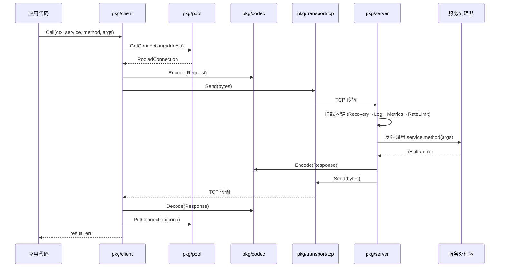
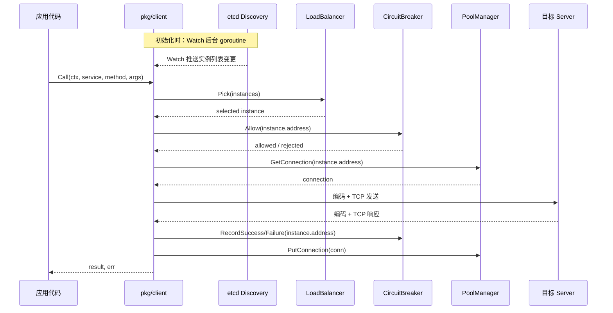
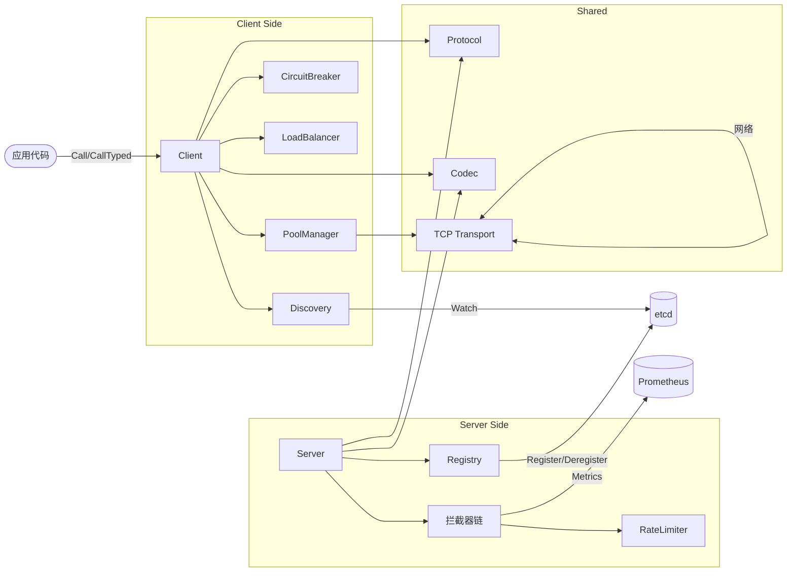

# 架构

## 系统上下文

RPCinGo 是一个纯 Go 实现的 RPC 框架库，不依赖外部进程（etcd 除外，仅在 Discovery 模式下需要）。它嵌入在用户的 Go 服务进程中，通过 TCP 连接与远端服务通信。

外部依赖关系：

| 外部系统       | 角色        | 模式             |
| ---------- | --------- | -------------- |
| etcd       | 服务注册/发现存储 | 仅 Discovery 模式 |
| Prometheus | 指标收集与监控   | 可选，通过拦截器接入     |
| 用户服务代码     | 注册服务实现    | 必须             |

## 五层架构

```
┌─────────────────────────────────────────────────┐
│               应用层 (Application)                │
│   client.Call() / server.RegisterService()       │
├─────────────────────────────────────────────────┤
│               RPC 核心层 (RPC Core)               │
│  Client + Server + 拦截器链 + 连接池 + 熔断器      │
├─────────────────────────────────────────────────┤
│               协议层 (Protocol)                   │
│     20字节固定头 + Request/Response/Error 结构     │
├─────────────────────────────────────────────────┤
│               编解码层 (Codec)                    │
│         JSON / Protobuf + Gzip 装饰器             │
├─────────────────────────────────────────────────┤
│               传输层 (Transport)                  │
│           TCP (NoDelay + KeepAlive)              │
└─────────────────────────────────────────────────┘
```

## 组件

| 组件 | 包路径 | 职责 |
|------|--------|------|
| Server | `pkg/server/` | 服务注册、请求路由、拦截器链执行 |
| Client | `pkg/client/` | 固定/发现双模式调用、Watch 机制 |
| Protocol | `pkg/protocol/` | 协议头/体定义、序列化/反序列化 |
| Codec | `pkg/codec/` | 编解码接口、JSON/Protobuf/Gzip 实现 |
| Transport | `pkg/transport/tcp/` | TCP 连接管理、两阶段读取 |
| Pool | `pkg/pool/` | 连接池与多地址 PoolManager |
| Registry | `pkg/registry/` | 服务注册/发现接口，etcd/memory 实现 |
| LoadBalancer | `pkg/loadbalancer/` | 轮询/随机/加权/一致性哈希 |
| CircuitBreaker | `pkg/circuitbreaker/` | 三状态机 + 滑动窗口 |
| RateLimiter | `pkg/ratelimiter/` | 令牌桶 + 滑动窗口限流 |
| Interceptor | `pkg/interceptor/` | Recovery/Logging/Metrics/RateLimit/Retry |
| Config | `pkg/config/` | YAML 配置解析与 Options 构建 |

## 关键流程

### 固定模式（Fixed Mode）请求流程



### 发现模式（Discovery Mode）请求流程



## 图表

### 组件关系图



## 接口与契约

### 核心接口一览

| 接口 | 文件 | 说明 |
|------|------|------|
| `Codec` | `pkg/codec/codec.go` | `Encode(v interface{}) ([]byte, error)` + `Decode(data []byte, v interface{}) error` |
| `StreamCodec` | `pkg/codec/codec.go` | `EncodeStream(w io.Writer, v interface{})` + `DecodeStream(r io.Reader, v interface{})` |
| `ClientTransport` | `pkg/transport/transport.go` | `Dial()`, `Send()`, `Close()` |
| `ServerTransport` | `pkg/transport/transport.go` | `Listen()`, `Serve()`, `Stop()` |
| `Registry` | `pkg/registry/registry.go` | `Register()`, `Deregister()`, `ListServices()` |
| `Discovery` | `pkg/registry/registry.go` | `GetInstances()`, `Watch()` |
| `LoadBalancer` | `pkg/loadbalancer/balancer.go` | `Pick(instances []ServiceInstance, opts ...) ServiceInstance` |
| `Interceptor` | `pkg/interceptor/interceptor.go` | `func(ctx, req, next HandlerFunc) (interface{}, error)` |

## 关键参数

| 参数 | 默认值 | 说明 |
|------|--------|------|
| `MaxConcurrent` | 无限制 | 服务端最大并发请求数 |
| `ReadTimeout` | 30s | 服务端读超时 |
| `WriteTimeout` | 30s | 服务端写超时 |
| `Pool.MinSize` | 2 | 连接池最小连接数 |
| `Pool.MaxSize` | 10 | 连接池最大连接数 |
| `Pool.IdleTimeout` | 5min | 空闲连接超时 |
| `CircuitBreaker.Threshold` | 可配置 | 触发熔断的失败率/次数阈值 |
| `RateLimiter.Rate` | 可配置 | 令牌桶每秒填充速率 |

## 错误处理与可靠性

RPCinGo 定义了 11 个标准错误码，覆盖客户端侧到服务端侧的映射：

| 错误码 | 含义 | 客户端行为 |
|--------|------|-----------|
| `OK` | 成功 | — |
| `Canceled` | 请求被取消 | 不重试 |
| `Unknown` | 未知错误 | 视情况重试 |
| `InvalidArgument` | 参数错误 | 不重试 |
| `DeadlineExceeded` | 超时 | 可重试（幂等操作） |
| `NotFound` | 资源不存在 | 不重试 |
| `AlreadyExists` | 资源已存在 | 不重试 |
| `PermissionDenied` | 权限拒绝 | 不重试 |
| `ResourceExhausted` | 资源耗尽（限流） | 可重试 |
| `Internal` | 服务端内部错误 | 视情况重试 |
| `Unavailable` | 服务不可用 | 可重试（触发熔断检查） |

**可靠性机制层次**：

```
RateLimit（限流）
    → CircuitBreaker（熔断：避免雪崩）
        → Retry（重试：仅幂等操作）
            → ConnectionPool（复用：降低建连开销）
```

## 示例代码片段

**服务端完整配置**：

```go
srv := server.New(
    server.WithAddress(":8080"),
    server.WithCodec(codec.NewJSONCodec()),
    server.WithCompressor(codec.NewGzipCompressor()),
    server.WithReadTimeout(30*time.Second),
    server.WithMaxConcurrent(1000),
    server.WithInterceptors(
        interceptor.Recovery(),
        interceptor.Logging(),
        interceptor.Metrics(),
        interceptor.RateLimit(rateLimiter),
    ),
    server.WithRegistry(etcdRegistry, "my-service", "localhost:8080"),
)
```

## 运行时与部署

| 模式 | 组件 | 说明 |
|------|------|------|
| 单机（Fixed） | 用户进程 | 无外部依赖，直接 TCP 通信 |
| 微服务（Discovery） | 用户进程 + etcd 集群 | 需要 etcd，推荐 3 节点 |
| 容器化 | Docker / K8s | `deployments/` 目录有配置 |

## 扩展性说明

- **吞吐量**：测试显示单节点 165,000+ QPS
- **并发**：基于 goroutine 模型，每个连接一个 goroutine
- **连接复用**：连接池减少 TCP 握手开销，支持 MinSize/MaxSize 动态调整
- **水平扩展**：Discovery 模式 + 一致性哈希支持有状态服务水平扩展

## Source References

- `pkg/server/server.go`
- `pkg/client/client.go`
- `pkg/client/options.go`
- `pkg/protocol/header.go`
- `pkg/protocol/message.go`
- `pkg/codec/codec.go`
- `pkg/transport/transport.go`
- `pkg/transport/tcp/server.go`
- `pkg/transport/tcp/client.go`
- `pkg/pool/pool.go`
- `pkg/pool/pool_manager.go`
- `pkg/registry/registry.go`
- `pkg/loadbalancer/balancer.go`
- `pkg/circuitbreaker/breaker.go`
- `pkg/interceptor/interceptor.go`
- `wiki/architecture/overview.md`
- `wiki/architecture/data-flow.md`
