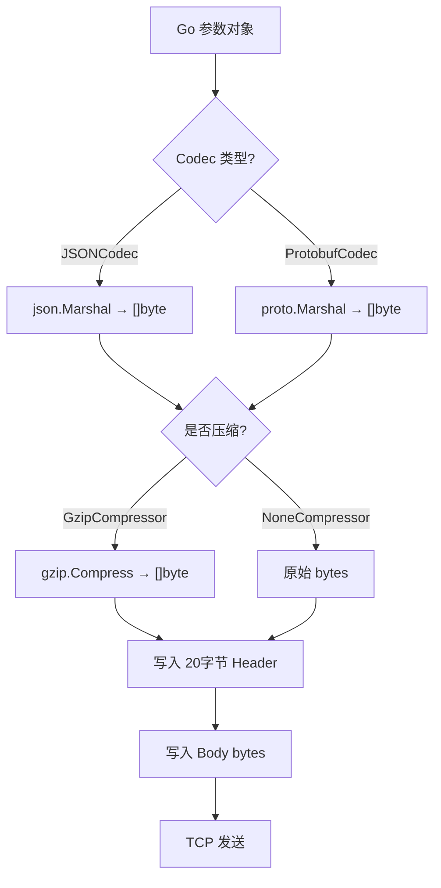
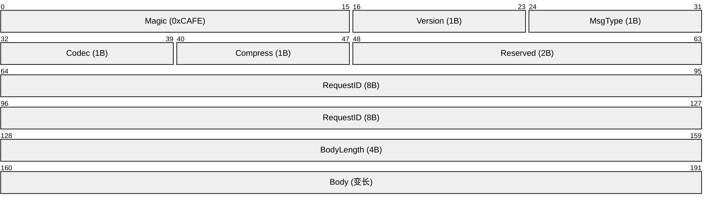
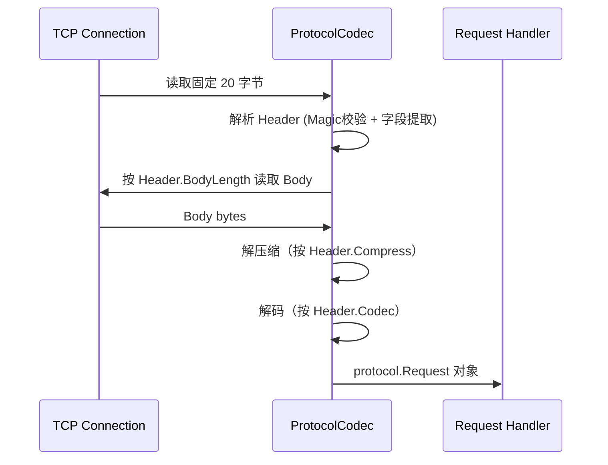
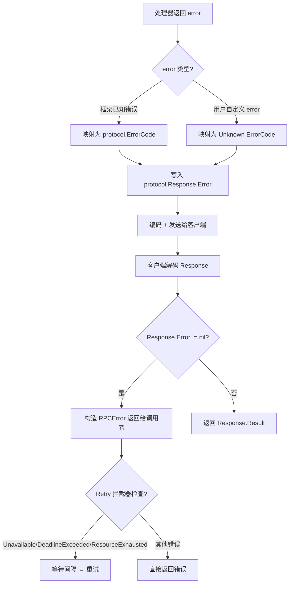

# 数据流

## 概述

RPCinGo 的数据流分为两个主要路径：**请求路径**（客户端 → 服务端）和**响应路径**（服务端 → 客户端）。中间经过编码、压缩、TCP 传输、解码等多个阶段。

## 主要流程

### 完整请求-响应生命周期

以下是一次 RPC 调用中数据经过的所有阶段：

| 阶段 | 组件 | 输入 | 输出 |
|------|------|------|------|
| 1. 构建请求 | `pkg/client` | 服务名、方法名、参数 Go 对象 | `protocol.Request` 结构体 |
| 2. 获取连接 | `pkg/pool` | 目标地址 | `PooledConnection` |
| 3. 编码请求体 | `pkg/codec` | `protocol.Request.Args` | `[]byte` |
| 4. 压缩（可选） | `pkg/codec` (GzipCompressor) | 原始 `[]byte` | 压缩后 `[]byte` |
| 5. 写协议头 | `pkg/transport/tcp` | Header 结构体（20字节） | TCP 字节流 |
| 6. 写请求体 | `pkg/transport/tcp` | `[]byte` | TCP 字节流 |
| 7. 服务端读头 | `pkg/transport/tcp` | TCP 字节流（20字节） | `protocol.Header` |
| 8. 服务端读体 | `pkg/transport/tcp` | TCP 字节流（Header.BodyLength字节） | `[]byte` |
| 9. 解压（可选） | `pkg/codec` | 压缩 `[]byte` | 原始 `[]byte` |
| 10. 解码请求体 | `pkg/codec` | `[]byte` | `protocol.Request` |
| 11. 拦截器链 | `pkg/interceptor` | `(ctx, req)` | `(ctx, req)` （可能修改/拒绝） |
| 12. 路由分发 | `pkg/server` | 服务名 + 方法名 | 反射调用目标方法 |
| 13. 执行处理器 | 用户代码 | 参数 | 返回值 / error |
| 14. 编码响应 | `pkg/codec` | 返回值 Go 对象 | `[]byte` |
| 15. 发送响应 | `pkg/transport/tcp` | `protocol.Response` | TCP 字节流 |
| 16. 客户端读响应 | `pkg/transport/tcp` | TCP 字节流 | `protocol.Response` |
| 17. 解码响应体 | `pkg/codec` | `[]byte` | Go 对象 |
| 18. 归还连接 | `pkg/pool` | `PooledConnection` | — |

## 图表

### 请求编码流程



### 协议帧结构



### 两阶段读取（TCP Server 端）



## 存储与状态

| 状态 | 存储位置 | 生命周期 |
|------|---------|---------|
| 在途请求 Map | `Client` 内存中的 `map[requestID]chan Response` | 请求发出 → 响应到达 |
| 连接池 | `pkg/pool.ConnectionPool` | 进程生命周期 |
| 服务实例列表 | `Client` 内存中的 `[]ServiceInstance` | Watch 持续更新 |
| 熔断器状态 | `CircuitBreaker` 内存，per-address | 进程生命周期 |
| 限流令牌 | `TokenBucket` 内存（原子操作） | 进程生命周期 |
| etcd 租约 | etcd 服务端 | 注册 → 注销 或 TTL 过期 |

## 主要流输入/输出

| 类型 | 名称 | 位置 | 说明 |
|------|------|------|------|
| Input | RPC 调用参数 | `client.Call(ctx, service, method, args)` | 用户传入的 Go 对象 |
| Input | 服务实例列表 | etcd Watch / memory 注册表 | Discovery 模式下动态更新 |
| Input | YAML 配置 | `configs/*.yaml` | 框架初始化配置 |
| Output | RPC 返回值 | `client.Call()` 返回 `(interface{}, error)` | 反序列化后的 Go 对象 |
| Output | Prometheus 指标 | HTTP `/metrics` 端点 | QPS、延迟直方图、错误率 |
| Output | 结构化日志 | stdout / 日志系统 | 每次 RPC 调用记录 |

## 错误传播路径



## Metadata 传递流程

Metadata 随 Request 透明传递，贯穿整个请求生命周期：

```
客户端设置 Metadata（trace-id, x-token 等）
    → 编码进 Request.Metadata map
    → 随协议体传输
    → 服务端拦截器从 ctx 读取（如 Logging 拦截器读取 trace-id）
    → 服务处理器可通过 ctx 访问
    → 响应的 Metadata 同样可以携带返回信息
```

**标准 Metadata Key**：

| Key | 用途 |
|-----|------|
| `trace-id` | 分布式追踪 ID |
| `span-id` | Span ID |
| `x-token` | 认证 Token |
| `x-user-id` | 用户 ID |
| `x-region` | 区域路由 |
| `x-zone` | 可用区 |
| `x-debug` | 调试开关 |

## Source References

- `pkg/protocol/header.go`
- `pkg/protocol/message.go`
- `pkg/transport/tcp/codec.go`
- `pkg/transport/tcp/client.go`
- `pkg/transport/tcp/server.go`
- `pkg/codec/codec.go`
- `pkg/codec/json.go`
- `pkg/codec/protobuf.go`
- `pkg/client/client.go`
- `pkg/pool/pool.go`
- `pkg/interceptor/logging.go`
- `wiki/architecture/data-flow.md`
- `wiki/protocol/message-format.md`
- `wiki/protocol/metadata.md`
