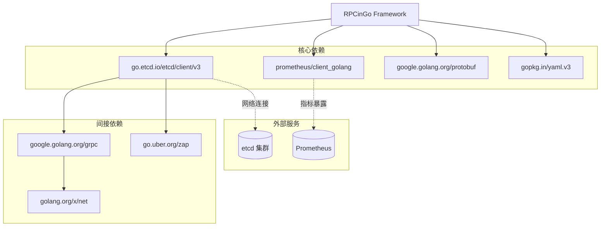

# 依赖关系

## 构建工具

| 工具 | 版本 | 用途 |
|------|------|------|
| Go | 1.24.5 | 主要编译器与运行时 |
| protoc | 最新版 | Protobuf 代码生成 |
| protoc-gen-go | 最新版 | Go Protobuf 插件 |
| etcd | 3.x | 本地开发服务发现 |

## 直接依赖（go.mod）

| 包 | 版本 | 用途 |
|----|------|------|
| `go.etcd.io/etcd/client/v3` | v3.6.7 | etcd 客户端，服务注册/发现 |
| `github.com/prometheus/client_golang` | v1.23.2 | Prometheus 指标采集 |
| `google.golang.org/protobuf` | v1.36.11 | Protobuf 序列化/反序列化 |
| `gopkg.in/yaml.v3` | v3.0.1 | YAML 配置文件解析 |

## 外部服务依赖

| 服务 | 必须/可选 | 使用场景 | 说明 |
|------|----------|---------|------|
| etcd | 可选（Discovery 模式必须） | 服务注册、发现、Watch | 推荐 3 节点集群 |
| Prometheus | 可选 | 指标采集 | 需挂载 `/metrics` 端点 |

## 间接依赖（主要）

| 包 | 说明 |
|----|------|
| `google.golang.org/grpc` | etcd client 内部使用 |
| `go.uber.org/zap` | etcd client 内部日志 |
| `github.com/grpc-ecosystem/grpc-gateway/v2` | etcd gRPC 网关 |
| `github.com/prometheus/common` | Prometheus 公共库 |
| `github.com/prometheus/procfs` | 进程指标采集 |
| `golang.org/x/net` | HTTP/2, 压缩等网络工具 |
| `golang.org/x/sys` | 系统调用封装 |

## 开发工具依赖

| 工具 | 用途 |
|------|------|
| `scripts/gen-example-proto.sh` | 自动生成 examples/ 的 Protobuf 代码 |
| `scripts/gen-example-proto.sh` 中的 `protoc-gen-go` | Go Protobuf 插件 |
| `go test ./...` | 运行全部测试 |

## 依赖关系图

## 版本约束说明

- **etcd v3.6.x**：与 v3.5.x API 有差异，升级时需注意 lease 续约接口变更
- **protobuf v1.36.x**：要求使用 `google.golang.org/protobuf`（新 API），不兼容旧的 `github.com/golang/protobuf`
- **Go 1.24.5**：使用了泛型（若有 CallTyped），需 1.18+；1.24 中 `sync.Map` 性能有所优化

## 无框架级外部依赖的模块

以下模块**仅使用 Go 标准库**，无需额外依赖：

| 模块 | 依赖情况 |
|------|---------|
| `pkg/protocol` | 仅 `encoding/binary`、`io` |
| `pkg/transport/tcp` | 仅 `net`、`sync`、`time` |
| `pkg/pool` | 仅 `sync`、`time`、`net` |
| `pkg/loadbalancer` | 仅 `sync`、`math/rand`、`crypto/md5` |
| `pkg/circuitbreaker` | 仅 `sync`、`time`、`sync/atomic` |
| `pkg/ratelimiter` | 仅 `sync`、`time`、`sync/atomic` |

## Source References

- `go.mod`
- `go.sum`
- `scripts/gen-example-proto.sh`
- `pkg/registry/etcd/`
- `pkg/interceptor/metrics.go`
- `pkg/codec/protobuf.go`
- `pkg/config/config.go`
- `wiki/`（各模块文档）
