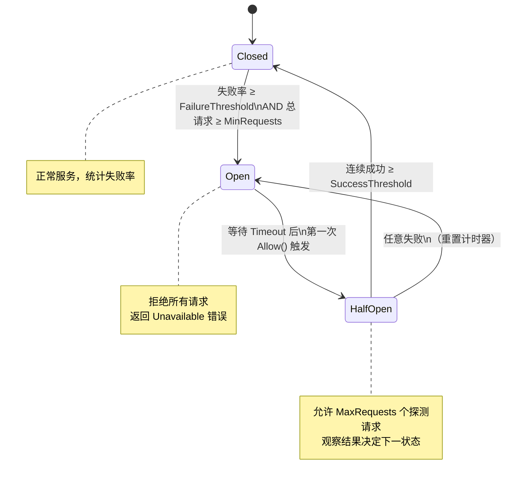

# 模块：CircuitBreaker（熔断器）

## 职责

- 实现经典三状态熔断机制：**Closed → Open → HalfOpen**
- 使用 `SlidingWindow`（10 个桶）统计失败率，避免短期抖动触发误熔断
- per-address 独立熔断：多实例场景下单节点故障不影响其他节点
- 提供服务端 `CircuitBreakerInterceptor`，也可集成到客户端 Discovery 模式

**源码位置**：`pkg/circuitbreaker/`（breaker.go 197 行、state.go 27 行、window.go 125 行）

## 关键文件

| 文件 | 行数 | 职责 |
|------|------|------|
| `pkg/circuitbreaker/state.go` | 27 | `State` 枚举（Closed/Open/HalfOpen）|
| `pkg/circuitbreaker/breaker.go` | 197 | `CircuitBreaker` 主体、状态转换逻辑 |
| `pkg/circuitbreaker/window.go` | 125 | `SlidingWindow` 滑动时间窗口 |

---

## 三状态机

```go
// pkg/circuitbreaker/state.go（27 行）
type State int

const (
    StateClosed   State = iota // 0：正常，请求正常通过
    StateOpen                  // 1：熔断，拒绝所有请求
    StateHalfOpen              // 2：探测，放行有限请求
)

func (s State) String() string {
    switch s {
    case StateClosed:   return "Closed"
    case StateOpen:     return "Open"
    case StateHalfOpen: return "HalfOpen"
    default:            return "Unknown"
    }
}
```

### 状态转换图



---

## Config 与初始化

```go
// pkg/circuitbreaker/breaker.go
type Config struct {
    MaxRequests      uint32        // HalfOpen 最多放行探测请求数，默认 1
    MinRequests      uint32        // 触发熔断所需最少请求样本，默认 10
    Interval         time.Duration // Closed 状态统计周期，默认 60s
    Timeout          time.Duration // Open 状态持续时间，默认 60s（到期转 HalfOpen）
    FailureThreshold float64       // 失败率阈值（0.0–1.0），默认 0.5（50%）
    SuccessThreshold uint32        // HalfOpen 连续成功次数达到此值后恢复 Closed，默认 1
}

type CircuitBreaker struct {
    mu      sync.Mutex
    state   State
    config  Config
    window  *SlidingWindow

    // HalfOpen 状态跟踪
    halfOpenRequests uint32
    halfOpenSuccess  uint32

    expiry time.Time // Open 状态到期时间
}

func NewCircuitBreaker(config Config) *CircuitBreaker {
    return &CircuitBreaker{
        config: config,
        state:  StateClosed,
        window: newSlidingWindow(config.Interval),
    }
}
```

---

## 核心方法

### Allow()

```go
func (cb *CircuitBreaker) Allow() bool {
    cb.mu.Lock()
    defer cb.mu.Unlock()

    now := time.Now()

    switch cb.state {
    case StateClosed:
        return true

    case StateOpen:
        if now.After(cb.expiry) {
            cb.toHalfOpen()
            return true // 放行第一个探测请求
        }
        return false

    case StateHalfOpen:
        if cb.halfOpenRequests < cb.config.MaxRequests {
            cb.halfOpenRequests++
            return true
        }
        return false // 超过 MaxRequests，拒绝
    }
    return false
}
```

### RecordSuccess() / RecordFailure()

```go
func (cb *CircuitBreaker) RecordSuccess() {
    cb.mu.Lock()
    defer cb.mu.Unlock()

    cb.window.RecordSuccess()

    if cb.state == StateHalfOpen {
        cb.halfOpenSuccess++
        if cb.halfOpenSuccess >= cb.config.SuccessThreshold {
            cb.toClosed() // 达到成功阈值，恢复 Closed
        }
    }
}

func (cb *CircuitBreaker) RecordFailure() {
    cb.mu.Lock()
    defer cb.mu.Unlock()

    cb.window.RecordFailure()

    switch cb.state {
    case StateClosed:
        if cb.shouldTrip() {
            cb.toOpen()
        }
    case StateHalfOpen:
        cb.toOpen() // 探测失败，回到 Open（重置计时器）
    }
}

func (cb *CircuitBreaker) shouldTrip() bool {
    total, failures := cb.window.Stats()
    if total < int64(cb.config.MinRequests) {
        return false // 样本不足，不触发（保护冷启动）
    }
    rate := float64(failures) / float64(total)
    return rate >= cb.config.FailureThreshold
}
```

### 状态转换

```go
func (cb *CircuitBreaker) toOpen() {
    cb.state = StateOpen
    cb.expiry = time.Now().Add(cb.config.Timeout)
    cb.window.Reset()
}

func (cb *CircuitBreaker) toHalfOpen() {
    cb.state = StateHalfOpen
    cb.halfOpenRequests = 0
    cb.halfOpenSuccess = 0
}

func (cb *CircuitBreaker) toClosed() {
    cb.state = StateClosed
    cb.window.Reset()
    cb.halfOpenRequests = 0
    cb.halfOpenSuccess = 0
}
```

---

## SlidingWindow（滑动时间窗口）

**源码**：`pkg/circuitbreaker/window.go`（125 行）

```go
type SlidingWindow struct {
    buckets  [10]*Bucket    // 固定 10 个桶
    size     int            // 桶数量（= 10）
    interval time.Duration  // 整个窗口大小（如 60s）
    // 每个桶覆盖 interval/size 的时间段（如 6s）
    mu       sync.Mutex
}

type Bucket struct {
    Success int64
    Failure int64
    Timeout int64
    expiry  time.Time
}

func (w *SlidingWindow) RecordSuccess() { /* 原子递增当前桶 */ }
func (w *SlidingWindow) RecordFailure() { /* 原子递增当前桶 */ }
func (w *SlidingWindow) RecordTimeout() { /* 原子递增当前桶，超时也算失败 */ }

// Stats 汇总所有有效桶（过期桶自动淘汰）
func (w *SlidingWindow) Stats() (total, failures int64) {
    w.mu.Lock()
    defer w.mu.Unlock()
    for _, b := range w.buckets {
        if b != nil && time.Now().Before(b.expiry) {
            total += b.Success + b.Failure + b.Timeout
            failures += b.Failure + b.Timeout // 超时也算失败
        }
    }
    return
}

func (w *SlidingWindow) FailureRate() float64 {
    total, failures := w.Stats()
    if total == 0 {
        return 0
    }
    return float64(failures) / float64(total)
}
```

**10 桶设计**：60 秒窗口，每桶 6 秒，提供足够精度的同时内存占用极小（仅 10 个 Bucket 结构）。

---

## 服务端拦截器

```go
// pkg/circuitbreaker/breaker.go
func CircuitBreakerInterceptor(cb *CircuitBreaker) interceptor.Interceptor {
    return func(ctx context.Context, req *protocol.Request,
        next interceptor.Invoker) (interface{}, error) {

        if !cb.Allow() {
            return nil, &protocol.Error{
                Code:    protocol.Unavailable,
                Message: "circuit breaker is open",
            }
        }

        result, err := next(ctx, req)

        if err != nil {
            cb.RecordFailure()
        } else {
            cb.RecordSuccess()
        }
        return result, err
    }
}
```

---

## 客户端配置（Discovery 模式）

```go
cli, _ := client.NewDiscoveryClient(
    client.WithCircuitBreaker(true),
    client.WithCircuitBreakerConfig(circuitbreaker.Config{
        MaxRequests:      3,     // HalfOpen 最多放 3 个探测请求
        MinRequests:      20,    // 至少 20 个请求才评估熔断
        Interval:         30 * time.Second,
        Timeout:          10 * time.Second,
        FailureThreshold: 0.5,
        SuccessThreshold: 2,     // 连续 2 次成功才恢复
    }),
)
```

## 获取熔断器状态

```go
cb := circuitbreaker.NewCircuitBreaker(config)
fmt.Println(cb.State())        // "Closed" / "Open" / "HalfOpen"
fmt.Println(cb.FailureRate())  // 当前失败率，如 0.35
total, failures := cb.window.Stats()
```

## 配置建议

| 场景 | MinRequests | FailureThreshold | Timeout |
|------|-------------|-----------------|---------|
| 内部服务（宽松）| 20 | 60% | 5s |
| 对外 API（标准）| 10 | 50% | 10s |
| 关键路径（严格）| 5 | 30% | 30s |

## 边界情况

- **MinRequests 保护**：总请求数 < MinRequests 时即使全部失败也不触发熔断（保护冷启动）
- **HalfOpen 并发**：同一时刻只允许 MaxRequests 个探测请求（mutex 控制）
- **RecordXxx 时序**：`Allow()` 返回 false 时不应调用 `RecordFailure()`（请求未执行）
- **HalfOpen 失败**：会重置 `expiry = time.Now() + Timeout`，而不是沿用原来的 expiry

## 测试

| 测试文件 | 内容 |
|---------|------|
| `pkg/circuitbreaker/breaker_test.go` | 三状态转换、滑动窗口统计、并发安全 |

## Source References

- `pkg/circuitbreaker/state.go`（27 行）
- `pkg/circuitbreaker/breaker.go`（197 行）
- `pkg/circuitbreaker/window.go`（125 行）
- `pkg/circuitbreaker/breaker_test.go`
- `pkg/client/client.go`（使用方）
- `wiki/reliability/circuit-breaker.md`
