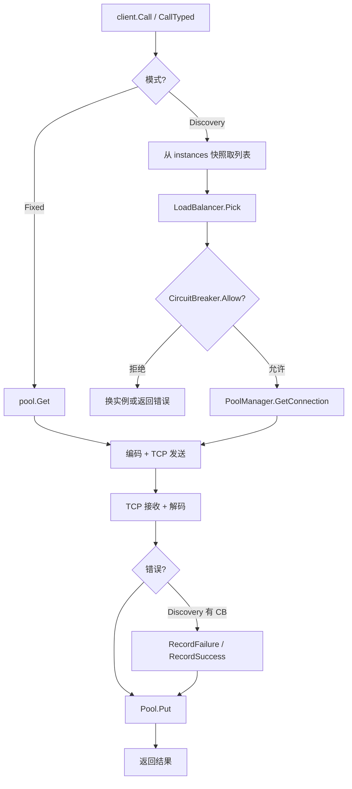

# 模块：Client（客户端）

> ⚠ 2026-06-02 重构：Fixed/Discovery 已收拢到 `connSource` 缝后，`Call` 单路径；`NewClient` 传 `WithDiscovery` 报错；`NewDiscoveryClient` 经 `WithManagerPoolSize` 应用 `WithPoolSize`；新增 `client.WithHashKey(ctx, key)` 亲和度。详见 [深化重构记录](../guides/deepening-refactors.md)（C1/C5）。

## 职责

- 提供 **Fixed 模式**（固定地址）和 **Discovery 模式**（服务发现）两种调用模式
- 暴露 `Call()`（无类型）和 `CallTyped()`（Protobuf 强类型）两套 API
- 在 Discovery 模式下，后台 Watch goroutine 持续订阅实例列表变更
- 每实例独立熔断器（`sync.Map` 懒初始化），集成 `PoolManager`、`LoadBalancer`

**源码位置**：`pkg/client/client.go`（351 行）、`pkg/client/options.go`（109 行）

## 关键文件

| 文件 | 行数 | 职责 |
|------|------|------|
| `pkg/client/client.go` | 351 | Client 主体，Call/CallTyped，Watch 机制 |
| `pkg/client/options.go` | 109 | clientOptions 定义与 WithXxx 函数 |
| `pkg/client/error_map.go` | — | unmapError：protocol.Error → Go error |

---

## Client 核心结构

```go
// pkg/client/client.go
type Client struct {
    opts clientOptions

    // Fixed 模式
    pool *pool.ConnectionPool

    // Discovery 模式
    discovery   registry.Discovery
    balancer    loadbalancer.LoadBalancer
    poolManager *pool.PoolManager
    breakers    sync.Map // map[address]*circuitbreaker.CircuitBreaker
    watcher     registry.Watcher
    instances   []*registry.ServiceInstance
    instancesMu sync.RWMutex
}
```

---

## ClientOptions 参数表

```go
// pkg/client/options.go（109 行）
type clientOptions struct {
    codec       protocol.CodecType
    compress    protocol.CompressType
    callTimeout time.Duration  // 默认 5s

    // 连接池
    minConnections int          // 默认 2
    maxConnections int          // 默认 10
    idleTimeout    time.Duration // 默认 60s

    // Discovery 模式
    discovery    registry.Discovery
    balancer     loadbalancer.LoadBalancer
    watchEnabled bool
    cbEnabled    bool
    breakerConfig circuitbreaker.Config

    // 拦截器
    interceptors []interceptor.Interceptor
}
```

| Option 函数 | 说明 | 默认值 |
|-------------|------|--------|
| `WithCodec(t)` | 序列化格式 | JSON |
| `WithCompress(t)` | 压缩算法 | None |
| `WithCallTimeout(d)` | 调用超时 | 5s |
| `WithMaxConnections(n)` | 连接池上限（每地址） | 10 |
| `WithMinConnections(n)` | 连接池下限（每地址） | 2 |
| `WithIdleTimeout(d)` | 连接空闲超时 | 60s |
| `WithDiscovery(d)` | 服务发现（Discovery 必须） | nil |
| `WithLoadBalancer(lb)` | 负载均衡算法 | RoundRobin |
| `WithWatch(bool)` | 启用后台实例 Watch | false |
| `WithCircuitBreaker(bool)` | 启用熔断器 | false |
| `WithInterceptors(...)` | 客户端拦截器 | 无 |

---

## 两种运行模式

### Fixed 模式

```go
cli, err := client.NewClient("127.0.0.1:8080",
    client.WithCodec(protocol.CodecTypeJSON),
    client.WithCompress(protocol.CompressTypeNone),
    client.WithCallTimeout(5 * time.Second),
    client.WithMaxConnections(100),
    client.WithMinConnections(10),
)
defer cli.Close()
```

内部调用路径：`pool.Get() → tcp.Send() → tcp.Receive() → pool.Put()`

### Discovery 模式

```go
disc, _ := etcd.NewDiscovery(etcd.WithEndpoints("localhost:2379"))

cli, err := client.NewDiscoveryClient(
    client.WithDiscovery(disc),
    client.WithLoadBalancer(loadbalancer.NewRoundRobin()),
    client.WithCircuitBreaker(true),
    client.WithCallTimeout(5 * time.Second),
    client.WithWatch(true),
    client.WithMaxConnections(20),
    client.WithMinConnections(2),
)
defer cli.Close()
```

---

## 两种调用接口

### Call()（无类型调用）

```go
func (c *Client) Call(ctx context.Context,
    service, method string,
    args interface{}) (interface{}, error)
```

```go
result, err := cli.Call(ctx, "UserService", "GetUser",
    map[string]interface{}{"user_id": 1001})
if err != nil { ... }
user := result.(map[string]interface{})
fmt.Println(user["name"])
```

### CallTyped()（强类型调用，推荐生产使用）

```go
func (c *Client) CallTyped(ctx context.Context,
    service, method string,
    req proto.Message,
    resp proto.Message) (*protocol.Response, error)
```

返回 `*protocol.Response` 以便读取服务端写回的响应级元数据（如 `span-id`）。

```go
req := &userpb.GetUserRequest{UserId: 1001}
resp := &userpb.GetUserResponse{}
rpcResp, err := cli.CallTyped(ctx, "UserService", "GetUser", req, resp)
if err != nil {
    log.Fatal(err)
}
fmt.Println(resp.Name)

// 读取服务端写回的 SpanID（需配合 TracingServer 拦截器）
if spanID, ok := rpcResp.GetMetadata("span-id"); ok {
    fmt.Println("Server SpanID:", spanID)
}
```

---

## Discovery 模式完整调用流程

```
cli.Call(ctx, "UserService", "GetUser", args)
    │
    │ 1. 获取实例列表（本地缓存，Watch 保持最新）
    │    c.instancesMu.RLock()
    │    instances = c.instances
    │    c.instancesMu.RUnlock()
    │    若为空 → GetInstances(ctx, "UserService")
    │
    │ 2. 负载均衡选择
    │    instance = loadBalancer.Pick(instances)
    │
    │ 3. 熔断器检查
    │    cb = c.getBreaker(instance.FullAddress())
    │    if !cb.Allow() { return nil, ErrServiceUnavailable }
    │
    │ 4. 从连接池取连接
    │    conn = poolManager.GetConnection(instance.FullAddress())
    │
    │ 5. 发送请求 / 接收响应
    │
    │ 6. 上报熔断统计
    │    if err != nil { cb.RecordFailure() }
    │    else          { cb.RecordSuccess() }
    │
    │ 7. 归还连接
    │    pool.Put(conn)
    ▼
返回 (result, error)
```

---

## Watch 机制实现

`WithWatch(true)` 时，`NewDiscoveryClient` 内部启动后台 goroutine：

```go
go func() {
    watcher, err := c.discovery.Watch(ctx, serviceName)
    if err != nil { return }
    defer watcher.Stop()

    for {
        event, err := watcher.Next()
        if err != nil {
            return // Watcher 关闭或 ctx 超时
        }

        c.instancesMu.Lock()
        switch event.Type {
        case registry.EventAdd:
            c.instances = append(c.instances, event.Instance)
            log.Printf("Instance added: %s", event.Instance.FullAddress())

        case registry.EventDelete:
            c.instances = removeInstance(c.instances, event.Instance.ID)
            // 关闭该实例的连接池，避免连接泄漏
            c.poolManager.RemovePool(event.Instance.FullAddress())
            log.Printf("Instance removed: %s", event.Instance.FullAddress())

        case registry.EventUpdate:
            c.instances = updateInstance(c.instances, event.Instance)
        }
        c.instancesMu.Unlock()
    }
}()
```

Watch 使实例列表始终最新：新实例注册后约 <1s 就能参与负载均衡，实例下线后立即从候选列表移除。

---

## 每实例熔断器

每个服务实例地址维护独立熔断器，存储在 `sync.Map` 中（懒初始化）：

```go
func (c *Client) getBreaker(address string) *circuitbreaker.CircuitBreaker {
    v, _ := c.breakers.LoadOrStore(address,
        circuitbreaker.NewCircuitBreaker(c.opts.breakerConfig))
    return v.(*circuitbreaker.CircuitBreaker)
}
```

**实例 A 熔断不影响实例 B**，负载均衡自动将流量引导到健康实例：

```
实例 10.0.0.1:8081  → Closed（正常）  ← 接收请求
实例 10.0.0.2:8081  → Open（熔断中）  ← 跳过
实例 10.0.0.3:8081  → Closed（正常）  ← 接收请求
```

**所有实例均熔断时**：

```go
// 客户端内部（简化）
for _, instance := range instances {
    cb := c.getBreaker(instance.FullAddress())
    if cb.Allow() {
        return c.doCall(ctx, instance, req)
    }
}
return nil, ErrAllInstancesUnavailable
```

---

## 生产推荐配置

```go
cli, err := client.NewDiscoveryClient(
    client.WithDiscovery(disc),
    client.WithLoadBalancer(loadbalancer.NewRoundRobin()),
    client.WithCircuitBreaker(true),
    client.WithCircuitBreakerConfig(circuitbreaker.Config{
        MinRequests:      20,
        FailureThreshold: 0.5,
        Timeout:          10 * time.Second,
        SuccessThreshold: 2,
    }),
    client.WithCallTimeout(3 * time.Second),
    client.WithMaxConnections(50),
    client.WithMinConnections(5),
    client.WithWatch(true),
    client.WithInterceptors(
        interceptor.NewRetryInterceptor(2, 200*time.Millisecond),
        interceptor.NewLoggingInterceptor(nil),
    ),
)
```

## 图表



## 边界情况

- **CallTyped 仅支持 Protobuf**：若 Codec 不是 ProtobufCodec，调用会返回错误
- **Watch goroutine 泄漏**：必须调用 `cli.Close()` 停止 Watch，建议使用 `defer`
- **实例列表为空**：返回 `Unavailable` 错误，调用方应重试或降级
- **所有实例熔断**：返回 `ErrAllInstancesUnavailable`，配合 Retry 拦截器等待恢复
- **并发 Call**：Client 是并发安全的，通过 `requestID` Map + channel 分离响应

## 测试

| 测试文件 | 内容 |
|---------|------|
| `pkg/client/client_typed_test.go` | CallTyped 强类型调用测试 |

## Source References

- `pkg/client/client.go`（351 行）
- `pkg/client/options.go`（109 行）
- `pkg/client/error_map.go`
- `pkg/pool/pool_manager.go`
- `pkg/loadbalancer/balancer.go`
- `pkg/circuitbreaker/breaker.go`
- `pkg/registry/etcd/`
- `wiki/client/overview.md`
- `wiki/client/fixed-mode.md`
- `wiki/client/discovery-mode.md`
