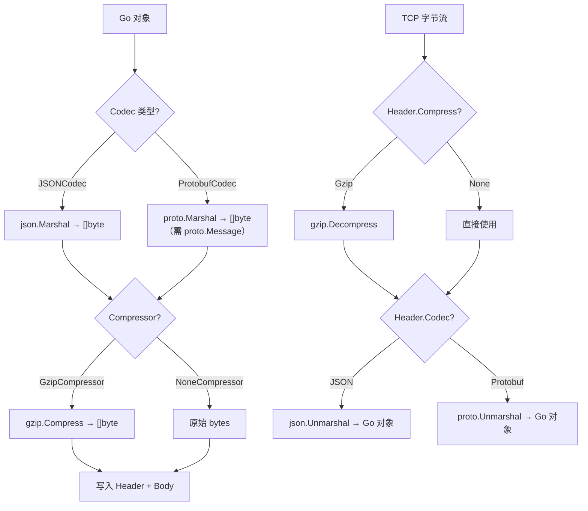

# 模块：Codec（编解码层）

## 职责

- 定义 `Codec` 和 `StreamCodec` 两套编解码接口
- 提供全局 Codec 注册表（`sync.RWMutex` 保护），各实现通过 `init()` 自动注册
- 提供 `JSONCodec`（314 行，含 Payload 自适应处理）实现
- 提供 `ProtobufCodec`（345 行，含 4 字节长度前缀帧）实现
- 提供 `CompressedCodec` 装饰器，透明叠加压缩到任意 Codec

**源码位置**：`pkg/codec/`（codec.go、json.go 314 行、protobuf.go 345 行、compress.go）

## 关键文件

| 文件 | 行数 | 职责 |
|------|------|------|
| `pkg/codec/codec.go` | — | `Codec`、`StreamCodec`、`Compressor` 接口 + 注册表 |
| `pkg/codec/json.go` | 314 | `JSONCodec`，Payload 自适应处理 |
| `pkg/codec/protobuf.go` | 345 | `ProtobufCodec`，4 字节帧，proto.Message 类型检查 |
| `pkg/codec/compress.go` | — | `GzipCompressor`、`NoneCompressor`、`CompressedCodec` |

---

## 接口定义

### Codec（内存缓冲，常用）

```go
// pkg/codec/codec.go
type Codec interface {
    Encode(v interface{}) ([]byte, error)
    Decode(data []byte, v interface{}) error
    Name() string
}
```

### StreamCodec（流式读写，减少 GC）

```go
type StreamCodec interface {
    EncodeToWriter(w io.Writer, v interface{}) error
    DecodeFromReader(r io.Reader, v interface{}) error
}
```

直接向 `io.Writer` 写入，避免中间 `[]byte` 分配，高 QPS 场景减少 GC 压力。Protobuf Codec 使用 **4 字节长度前缀帧**（StreamCodec 实现）。

### Compressor 接口

```go
type Compressor interface {
    Compress(data []byte) ([]byte, error)
    Decompress(data []byte) ([]byte, error)
    Name() string
}
```

---

## 全局注册表

```go
// pkg/codec/codec.go
var defaultRegistry = &codecRegistry{
    codecs: make(map[protocol.CodecType]Codec),
}

func Register(t protocol.CodecType, c Codec) {
    defaultRegistry.mu.Lock()
    defer defaultRegistry.mu.Unlock()
    defaultRegistry.codecs[t] = c
}

func Get(t protocol.CodecType) Codec {
    defaultRegistry.mu.RLock()
    defer defaultRegistry.mu.RUnlock()
    return defaultRegistry.codecs[t]
}
```

各 Codec 在 `init()` 中自动注册，应用层无需手动调用：

```go
// pkg/codec/json.go
func init() { codec.Register(protocol.CodecTypeJSON, &JSONCodec{}) }

// pkg/codec/protobuf.go
func init() { codec.Register(protocol.CodecTypeProtobuf, &ProtobufCodec{}) }
```

---

## JSONCodec（314 行）

### Payload 自适应处理

JSON Codec 最复杂的逻辑是智能处理 `Args`/`Data` 字段，因为其类型是 `interface{}`，内容可能是普通 Go 对象或已序列化的 `[]byte`：

```go
// 编码 Request（简化版）
func (c *JSONCodec) EncodeRequest(req *protocol.Request) ([]byte, error) {
    wrapper := &jsonRequest{
        ID: req.ID, Service: req.Service, Method: req.Method,
        Metadata: req.Metadata, CreatedAt: req.CreatedAt,
        ArgsCodec: req.ArgsCodec,
        // ... 其他字段
    }

    // Args 字段智能处理
    switch v := req.Args.(type) {
    case []byte:
        // 已是字节数组（如 Protobuf 序列化结果），直接嵌入
        wrapper.Args = json.RawMessage(v)
    case json.RawMessage:
        wrapper.Args = v
    default:
        // 普通 Go 对象，序列化为 JSON
        argsBytes, err := json.Marshal(v)
        if err != nil {
            return nil, err
        }
        wrapper.Args = json.RawMessage(argsBytes)
    }

    return json.Marshal(wrapper)
}
```

这使得框架可以**混合使用**：消息封装用 JSON，内部 payload 用 Protobuf。

### 基础接口

```go
type JSONCodec struct{}

func (c *JSONCodec) Encode(v interface{}) ([]byte, error) { return json.Marshal(v) }
func (c *JSONCodec) Decode(data []byte, v interface{}) error { return json.Unmarshal(data, v) }
func (c *JSONCodec) Name() string { return "json" }
```

### 性能数据

| 操作 | 消息大小 | 耗时 |
|------|---------|------|
| 编码 | 100B | ~100ns |
| 解码 | 100B | ~200ns |
| 编码 | 10KB | ~3µs |
| 解码 | 10KB | ~8µs |
| 编码 + Gzip | 10KB | +0.5ms |

---

## ProtobufCodec（345 行）

### 类型检查（Encode/Decode 均做）

```go
func (c *ProtobufCodec) Encode(v interface{}) ([]byte, error) {
    msg, ok := v.(proto.Message)
    if !ok {
        return nil, fmt.Errorf("protobuf codec: %T does not implement proto.Message", v)
    }
    return proto.Marshal(msg)
}

func (c *ProtobufCodec) Decode(data []byte, v interface{}) error {
    msg, ok := v.(proto.Message)
    if !ok {
        return fmt.Errorf("protobuf codec: %T does not implement proto.Message", v)
    }
    return proto.Unmarshal(data, msg)
}
```

### StreamCodec：4 字节长度前缀帧

```go
// 写入格式：[len(4B, big-endian)] [protobuf bytes]
func (c *ProtobufCodec) EncodeToWriter(w io.Writer, v interface{}) error {
    msg := v.(proto.Message)
    data, err := proto.Marshal(msg)
    if err != nil {
        return err
    }
    lenBuf := make([]byte, 4)
    binary.BigEndian.PutUint32(lenBuf, uint32(len(data)))
    if _, err := w.Write(lenBuf); err != nil {
        return err
    }
    _, err = w.Write(data)
    return err
}

func (c *ProtobufCodec) DecodeFromReader(r io.Reader, v interface{}) error {
    msg := v.(proto.Message)
    lenBuf := make([]byte, 4)
    if _, err := io.ReadFull(r, lenBuf); err != nil {
        return err
    }
    length := binary.BigEndian.Uint32(lenBuf)
    data := make([]byte, length)
    if _, err := io.ReadFull(r, data); err != nil {
        return err
    }
    return proto.Unmarshal(data, msg)
}
```

### 性能对比（Protobuf vs JSON）

| 操作 | JSON | Protobuf | 倍数 |
|------|------|----------|------|
| 编码 1KB | ~3µs | ~0.5µs | 6x 快 |
| 解码 1KB | ~8µs | ~1µs | 8x 快 |
| 消息体积 | 1KB | ~250B | 4x 小 |

---

## 压缩装饰器（CompressedCodec）

```go
// pkg/codec/compress.go
type CompressedCodec struct {
    inner      Codec
    compressor Compressor
}

// 编码：先序列化，再压缩
func (c *CompressedCodec) Encode(v interface{}) ([]byte, error) {
    data, err := c.inner.Encode(v)
    if err != nil {
        return nil, err
    }
    return c.compressor.Compress(data)
}

// 解码：先解压，再反序列化
func (c *CompressedCodec) Decode(data []byte, v interface{}) error {
    decompressed, err := c.compressor.Decompress(data)
    if err != nil {
        return err
    }
    return c.inner.Decode(decompressed, v)
}
```

**创建带 Gzip 的 JSON Codec**：

```go
gzipJSON := &codec.CompressedCodec{
    Inner:      codec.Get(protocol.CodecTypeJSON),
    Compressor: codec.GetCompressor(protocol.CompressTypeGzip),
}
```

服务端配置 `WithCodec(CodecTypeJSON, CompressTypeGzip)` 时，框架内部自动创建此装饰器。

---

## 图表



## 选择指南

| 条件 | 推荐 |
|------|------|
| 开发/调试，需人类可读 | JSON + None |
| 小消息（< 1KB），低 QPS | JSON + None |
| 大消息（> 1KB），带宽受限 | JSON + Gzip |
| 生产高 QPS（> 50k）| **Protobuf + None** |
| 超大 Proto 消息 | Protobuf + Gzip |

## 测试

| 测试文件 | 内容 |
|---------|------|
| `pkg/codec/codec_test.go` | 接口公共行为测试 |
| `pkg/codec/json_test.go` | JSONCodec 序列化/Payload 自适应 |
| `pkg/codec/protobuf_test.go` | ProtobufCodec 正确性与类型检查 |

## Source References

- `pkg/codec/codec.go`（注册表）
- `pkg/codec/json.go`（314 行）
- `pkg/codec/protobuf.go`（345 行）
- `pkg/codec/compress.go`
- `pkg/codec/codec_test.go`
- `pkg/codec/json_test.go`
- `pkg/codec/protobuf_test.go`
- `wiki/codec/overview.md`
- `wiki/codec/json.md`
- `wiki/codec/protobuf.md`
