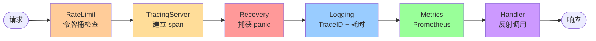

# 模块：Interceptor（拦截器）

## 职责

- 定义中间件/拦截器接口（`Interceptor` 函数类型）和 `Chain` 洋葱结构
- 提供内置服务端拦截器：`Recovery`、`Logging`、`Metrics`、`RateLimit`
- 提供客户端拦截器：`Retry`（支持可重试错误码自动重试，含 ctx 感知的 sleep）
- 支持自定义拦截器（如认证、链路追踪）

**源码位置**：`pkg/interceptor/`（interceptor.go 42 行、logging.go 51 行、metrics.go 57 行、retry.go 68 行）

## 关键文件

| 文件 | 职责 |
|------|------|
| `pkg/interceptor/interceptor.go` | `Interceptor` 类型 + `Chain` + `Intercept` |
| `pkg/interceptor/logging.go` | `Logging` 拦截器（含 TraceID 输出）|
| `pkg/interceptor/metrics.go` | `Metrics` 拦截器（Prometheus）|
| `pkg/interceptor/retry.go` | `Retry` 拦截器 |
| `pkg/interceptor/ratelimit.go` | `RateLimit` 拦截器 |
| `pkg/interceptor/recovery.go` | `Recovery` 拦截器 |
| `pkg/interceptor/tracing.go` | `TracingClient` + `TracingServer` 拦截器（OTel）|

---

## 核心类型

```go
// pkg/interceptor/interceptor.go（42 行）

// 调用链的下一个节点（最终是实际的 handler）
type Invoker func(ctx context.Context, req *protocol.Request) (interface{}, error)

// 拦截器函数类型
type Interceptor func(ctx context.Context, req *protocol.Request, next Invoker) (interface{}, error)

// 链：按注册顺序逆向嵌套，形成洋葱结构
type Chain struct {
    interceptors []Interceptor
}

func NewChain(interceptors ...Interceptor) *Chain {
    return &Chain{interceptors: interceptors}
}

func (c *Chain) Execute(ctx context.Context, req *protocol.Request, final Invoker) (interface{}, error) {
    // 从后往前构建嵌套闭包
    h := final
    for i := len(c.interceptors) - 1; i >= 0; i-- {
        next := h                        // 每次迭代用 := 创建新变量，闭包捕获的是本次迭代的副本
        interceptor := c.interceptors[i] // 同上，不依赖 Go 1.22 的 for 循环变量语义修复
        h = func(ctx context.Context, req *protocol.Request) (interface{}, error) {
            return interceptor(ctx, req, next)
        }
    }
    return h(ctx, req)
}
```

### 执行顺序（洋葱模型）

注册顺序：`[Recovery, Logging, Metrics, RateLimit]`

```
请求进入 → Recovery → Logging → Metrics → RateLimit → [Handler]
响应返回 ← Recovery ← Logging ← Metrics ← RateLimit ← [Handler]
```

---

## 内置拦截器

### 1. Recovery（Panic 恢复）

**源码**：`pkg/interceptor/recovery.go`（25 行）

```go
func NewRecoveryInterceptor() Interceptor {
    return func(ctx context.Context, req *protocol.Request,
        next Invoker) (result interface{}, err error) {
        defer func() {
            if r := recover(); r != nil {
                stack := make([]byte, 4096)
                stack = stack[:runtime.Stack(stack, false)]
                err = fmt.Errorf("panic recovered: %v\n%s", r, stack)
                // result 由 named return 初始化为 nil
            }
        }()
        return next(ctx, req)
    }
}
```

**配置建议**：必须放在拦截器链**最外层（第一个注册）**，确保包括后续拦截器中的 panic 都能被捕获。

---

### 2. Logging（请求日志）

**源码**：`pkg/interceptor/logging.go`

接受 `logger.Logger`（来自 `pkg/logger`），nil 时自动使用 `logger.New()`（slog 文本格式）。

```go
import "RPCinGo/pkg/logger"

func Logging(l logger.Logger) Interceptor {
    if l == nil {
        l = logger.New()
    }
    return func(ctx context.Context, req *protocol.Request, invoker Invoker) (any, error) {
        start := time.Now()
        traceID := tracing.TraceID(ctx)

        resp, err := invoker(ctx, req)

        dur := time.Since(start)
        if err != nil {
            l.Error("rpc call failed",
                "service", req.Service, "method", req.Method,
                "trace", traceID, "duration", dur, "error", err)
        } else {
            l.Info("rpc call ok",
                "service", req.Service, "method", req.Method,
                "trace", traceID, "duration", dur)
        }
        return resp, err
    }
}
```

日志使用 slog key-value 结构化格式，自动包含 `trace` 字段（来自 OTel span context）：

```
time=... level=INFO  msg="rpc call ok"     service=Calculator method=Add  trace=4bf92f... duration=1.2ms
time=... level=ERROR msg="rpc call failed" service=Calculator method=Div  trace=4bf92f... duration=5ms error="division by zero"
```

---

### 3. Metrics（Prometheus 监控）

**源码**：`pkg/interceptor/metrics.go`（57 行）

```go
var (
    rpcCallsTotal = prometheus.NewCounterVec(
        prometheus.CounterOpts{
            Name: "rpc_calls_total",
            Help: "Total number of RPC calls",
        },
        []string{"service", "method", "status"},
    )

    rpcDurationSeconds = prometheus.NewHistogramVec(
        prometheus.HistogramOpts{
            Name:    "rpc_duration_seconds",
            Help:    "RPC call duration in seconds",
            Buckets: prometheus.DefBuckets, // .005, .01, .025, .05, .1, .25, .5, 1, 2.5, 5, 10
        },
        []string{"service", "method"},
    )
)

func init() {
    prometheus.MustRegister(rpcCallsTotal, rpcDurationSeconds)
}

func NewMetricsInterceptor() Interceptor {
    return func(ctx context.Context, req *protocol.Request, next Invoker) (interface{}, error) {
        start := time.Now()

        result, err := next(ctx, req)

        duration := time.Since(start).Seconds()
        status := "success"
        if err != nil {
            status = "error"
        }

        rpcCallsTotal.WithLabelValues(req.Service, req.Method, status).Inc()
        rpcDurationSeconds.WithLabelValues(req.Service, req.Method).Observe(duration)

        return result, err
    }
}
```

---

### 4. RateLimit（限流）

**源码**：`pkg/interceptor/ratelimit.go`（20 行）

```go
func NewRateLimitInterceptor(limiter ratelimiter.RateLimiter) Interceptor {
    return func(ctx context.Context, req *protocol.Request, next Invoker) (interface{}, error) {
        if !limiter.Allow() {
            return nil, ratelimiter.ErrRateLimitExceeded
            // error_map.go 将其映射为 ResourceExhausted 错误码
        }
        return next(ctx, req)
    }
}
```

---

### 5. Retry（重试，通常用于客户端）

**源码**：`pkg/interceptor/retry.go`（68 行）

```go
func NewRetryInterceptor(maxRetries int, interval time.Duration) Interceptor {
    return func(ctx context.Context, req *protocol.Request, next Invoker) (interface{}, error) {
        var lastErr error
        for attempt := 0; attempt <= maxRetries; attempt++ {
            if attempt > 0 {
                select {
                case <-time.After(interval):
                case <-ctx.Done():
                    return nil, ctx.Err()
                }
            }

            result, err := next(ctx, req)
            if err == nil {
                return result, nil
            }
            if !isRetryable(err) {
                return nil, err
            }
            lastErr = err
        }
        return nil, lastErr
    }
}

// 可重试的错误码
func isRetryable(err error) bool {
    var protoErr *protocol.Error
    if !errors.As(err, &protoErr) {
        return false
    }
    switch protoErr.Code {
    case protocol.Unavailable,        // 服务暂时不可用（熔断）
        protocol.DeadlineExceeded,     // 超时
        protocol.ResourceExhausted:    // 被限流
        return true
    default:
        return false
    }
}
```

---

## 服务端配置（推荐顺序）

```go
srv := server.NewServer(
    server.WithAddress(":8080"),
    server.WithRateLimit(ratelimiter.NewTokenBucket(10000, 500)), // 自动前置，最先执行
    server.WithInterceptors(
        interceptor.TracingServer(), // 1. 建立 span，注入 TraceID 到 context
        interceptor.Recovery(),      // 2. panic 兜底
        interceptor.Logging(nil),    // 3. 打印 TraceID + 耗时
        interceptor.Metrics(),       // 4. Prometheus 指标
    ),
)
```

推荐顺序说明：

| 位置 | 拦截器 | 原因 |
|------|-------|------|
| 0（WithRateLimit）| RateLimit | 超限直接拒绝，不产生 span/日志开销 |
| 1（最外）| TracingServer | 最先建立 span，后续拦截器都能从 ctx 读到 TraceID |
| 2 | Recovery | panic 兜底，在 Tracing 之内确保 span 能正常 End |
| 3 | Logging | 依赖 TracingServer 已注入的 TraceID |
| 4 | Metrics | 最靠近 handler，计时最准确 |

## 客户端配置

```go
cli, _ := client.NewClient("127.0.0.1:8080",
    client.WithRateLimit(ratelimiter.NewTokenBucket(500, 50)),
    client.WithClientInterceptors(
        interceptor.TracingClient(), // 创建 client span，通过 req.Metadata 传播 trace 上下文
        interceptor.Logging(nil),
    ),
)
```

---

## 自定义拦截器示例

**认证拦截器**（验证 Metadata 中的 Token）：

```go
func AuthInterceptor(tokenValidator func(token string) bool) interceptor.Interceptor {
    return func(ctx context.Context, req *protocol.Request,
        next interceptor.Invoker) (interface{}, error) {

        token := req.Metadata.Get(protocol.MetadataKeyToken)
        if token == "" {
            return nil, &protocol.Error{
                Code:    protocol.PermissionDenied,
                Message: "missing auth token",
            }
        }
        if !tokenValidator(token) {
            return nil, &protocol.Error{
                Code:    protocol.PermissionDenied,
                Message: "invalid token",
            }
        }

        // 将 userID 注入 context，供 handler 使用
        userID := req.Metadata.Get(protocol.MetadataKeyUserID)
        ctx = context.WithValue(ctx, "user-id", userID)

        return next(ctx, req)
    }
}
```

---

## 图表



## 边界情况

- **Recovery 位置**：必须最先，否则后续拦截器中的 panic 无法被捕获
- **Retry 与幂等性**：仅应用于幂等操作，非幂等请求重试可能导致数据重复
- **Metrics 注册冲突**：测试中多次注册同一指标会 panic，应使用 `prometheus.NewRegistry()` 创建独立注册表
- **拦截器中修改 req**：Logging 等读取 Metadata 应只读访问，避免并发修改

## 测试

| 测试文件 | 内容 |
|---------|------|
| `pkg/interceptor/interceptor_test.go` | Chain 组合、各拦截器行为、panic recovery |

## Source References

- `pkg/interceptor/interceptor.go`
- `pkg/interceptor/recovery.go`
- `pkg/interceptor/logging.go`
- `pkg/interceptor/metrics.go`
- `pkg/interceptor/retry.go`
- `pkg/interceptor/ratelimit.go`
- `pkg/interceptor/tracing.go`
- `pkg/tracing/tracing.go`
- `pkg/interceptor/interceptor_test.go`
- `wiki/server/interceptors.md`
- `wiki/observability/metrics.md`
- `deepwiki/guides/telemetry.md`
