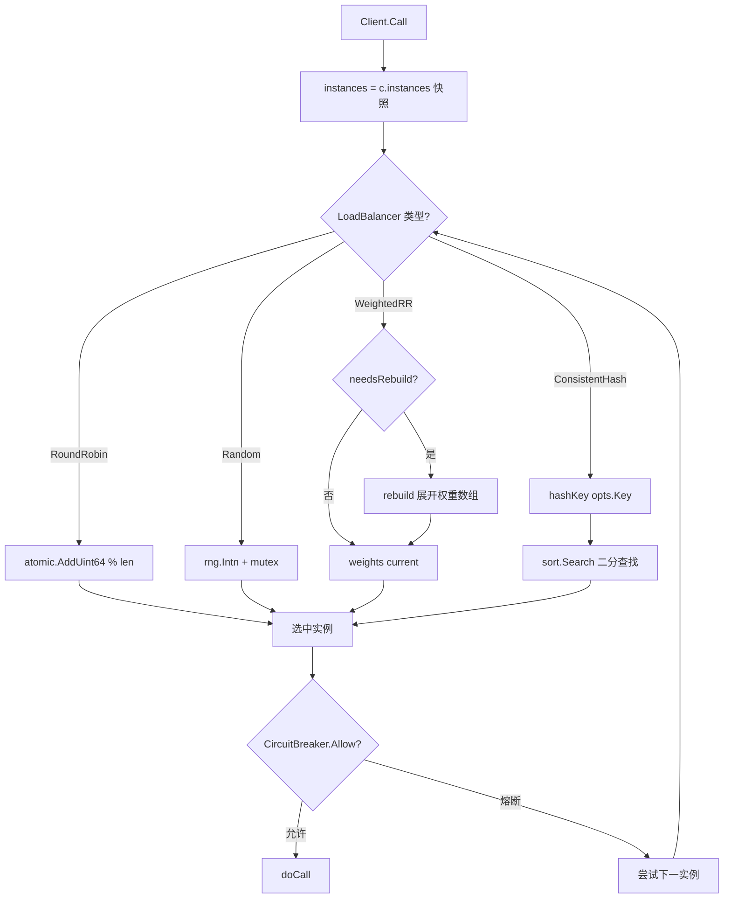

# 模块：LoadBalancer（负载均衡）

> ⚠ 2026-06-02 重构：一致性哈希亲和度现可达 —— `NewPickOptions(key)` / `(*PickOptions).Key()` / `WithKey()`，调用侧用 `client.WithHashKey(ctx, key)` 贯通。详见 [深化重构记录](../guides/deepening-refactors.md)（C5）。

## 职责

- 定义 `LoadBalancer` 接口（`Pick()`）和 `BalancerWithOptions` 扩展接口（`PickWithOptions()`）
- 提供四种算法实现：Round Robin（原子无锁）、Random（私有 rand）、Weighted Round Robin（展开权重数组）、Consistent Hash（MD5 + 虚拟节点 + 二分查找）
- 支持通过 `PickOptions.Key` 传递路由键（用于一致性哈希粘性路由）
- 实例列表由外部（Client Watch 机制）维护，每次 `Pick()` 传入最新列表，无需重启重建

**源码位置**：`pkg/loadbalancer/`（balancer.go 31 行、roundrobin.go 33 行、random.go 35 行、weighted.go 85 行、consistent.go 127 行）

## 关键文件

| 文件 | 行数 | 职责 |
|------|------|------|
| `pkg/loadbalancer/balancer.go` | 31 | 接口定义、`PickOptions`、错误变量 |
| `pkg/loadbalancer/roundrobin.go` | 33 | `RoundRobinBalancer`，原子计数器 |
| `pkg/loadbalancer/random.go` | 35 | `RandomBalancer`，私有 rand + mutex |
| `pkg/loadbalancer/weighted.go` | 85 | `WeightedRoundRobinBalancer`，展开权重数组 |
| `pkg/loadbalancer/consistent.go` | 127 | `ConsistentHashBalancer`，MD5 + 虚拟节点 |

---

## 接口定义

### LoadBalancer 基础接口

```go
// pkg/loadbalancer/balancer.go（31 行）
type LoadBalancer interface {
    // Pick 从实例列表中选择一个
    Pick(instances []*registry.ServiceInstance) (*registry.ServiceInstance, error)
    // Name 返回算法名称（如 "round_robin"）
    Name() string
}

// 所有实现都返回此错误（当 instances 为空时）
var ErrNoAvailableInstances = errors.New("no available instances")
```

### BalancerWithOptions 扩展接口

```go
// 扩展接口：支持基于 Key 的路由（一致性哈希需要）
type BalancerWithOptions interface {
    LoadBalancer
    PickWithOptions(instances []*registry.ServiceInstance,
        opts PickOptions) (*registry.ServiceInstance, error)
}

type PickOptions struct {
    Key      string            // 路由键（如用户 ID、Session ID）
    Metadata map[string]string // 额外路由元数据
}
```

---

## 四种实现

| 实现 | 构造函数 | 算法 | 并发安全 | 粘性 |
|------|---------|------|---------|------|
| `RoundRobinBalancer` | `NewRoundRobin()` | 顺序轮询 | 原子操作（无锁）| ❌ |
| `RandomBalancer` | `NewRandom()` | 随机 | 互斥锁 | ❌ |
| `WeightedRoundRobinBalancer` | `NewWeightedRoundRobin()` | 加权轮询 | 互斥锁 | ❌ |
| `ConsistentHashBalancer` | `NewConsistentHash(vNodes)` | 一致性哈希（MD5）| 读写锁 | ✅ |

---

## Round Robin（轮询）

**源码**：`pkg/loadbalancer/roundrobin.go`（33 行）

```go
type RoundRobinBalancer struct {
    counter uint64 // 原子计数器，无锁实现
}

func NewRoundRobin() *RoundRobinBalancer {
    return &RoundRobinBalancer{}
}

func (r *RoundRobinBalancer) Pick(instances []*registry.ServiceInstance) (*registry.ServiceInstance, error) {
    if len(instances) == 0 {
        return nil, ErrNoAvailableInstances
    }
    idx := atomic.AddUint64(&r.counter, 1) % uint64(len(instances))
    return instances[idx], nil
}

func (r *RoundRobinBalancer) Name() string { return "round_robin" }
```

**特性**：
- 使用 `sync/atomic` 原子自增，完全无锁，极高并发性能
- 请求按索引循环分配，每个实例获得相同数量的请求
- `counter` 溢出后自然回绕，不影响正确性
- 实例列表由外部传入，变化后自动适应（无需重置 counter）

---

## Random（随机）

**源码**：`pkg/loadbalancer/random.go`（35 行）

```go
type RandomBalancer struct {
    mu  sync.Mutex
    rng *rand.Rand
}

func NewRandom() *RandomBalancer {
    return &RandomBalancer{
        rng: rand.New(rand.NewSource(time.Now().UnixNano())),
    }
}

func (r *RandomBalancer) Pick(instances []*registry.ServiceInstance) (*registry.ServiceInstance, error) {
    if len(instances) == 0 {
        return nil, ErrNoAvailableInstances
    }
    r.mu.Lock()
    idx := r.rng.Intn(len(instances))
    r.mu.Unlock()
    return instances[idx], nil
}
```

**特性**：
- 使用私有 `rand.Rand`（非全局 `math/rand`，避免全局锁竞争），加 `sync.Mutex` 保护
- 大量请求下统计上均匀，少量请求可能偏斜
- 比 Round Robin 稍慢（需要加锁），但差异在实际 RPC 调用中可忽略

---

## Weighted Round Robin（加权轮询）

**源码**：`pkg/loadbalancer/weighted.go`（85 行）

```go
type WeightedRoundRobinBalancer struct {
    mu          sync.Mutex
    weights     []int    // 展开后的权重数组（如 weight=[3,1,2] → [0,0,0,1,2,2]）
    current     int      // 当前位置
    lastInstIDs []string // 上次构建时的实例 ID 列表（检测是否需要重建）
}

func (r *WeightedRoundRobinBalancer) Pick(
    instances []*registry.ServiceInstance) (*registry.ServiceInstance, error) {

    if len(instances) == 0 {
        return nil, ErrNoAvailableInstances
    }

    r.mu.Lock()
    defer r.mu.Unlock()

    // 检测实例列表是否变化，若变化则重建权重数组
    if r.needsRebuild(instances) {
        r.rebuild(instances)
    }

    // 在权重数组中选择当前位置
    idx := r.weights[r.current]
    r.current = (r.current + 1) % len(r.weights)

    return instances[idx], nil
}
```

### 权重数组构建（rebuild）

```go
// 构建展开权重数组
// instances[0].Weight=3, instances[1].Weight=1, instances[2].Weight=2
// → weights = [0, 0, 0, 1, 2, 2]（实例下标重复出现 Weight 次）
func (r *WeightedRoundRobinBalancer) rebuild(instances []*registry.ServiceInstance) {
    weights := make([]int, 0)
    for i, inst := range instances {
        w := inst.Weight
        if w <= 0 {
            w = 1 // 默认权重为 1
        }
        for j := 0; j < w; j++ {
            weights = append(weights, i)
        }
    }
    r.weights = weights
    r.current = 0
    // 记录实例 ID 列表，用于下次变化检测
    r.lastInstIDs = make([]string, len(instances))
    for i, inst := range instances {
        r.lastInstIDs[i] = inst.ID
    }
}
```

### 权重配置

```go
// 服务端注册时设置权重
srv := server.NewServer(
    server.WithWeight(3), // 该实例权重为 3
)

// 或在 ServiceInstance 中直接设置
inst := &registry.ServiceInstance{
    ID:      "server-1",
    Weight:  3, // 接受约 50% 流量（3/(3+1+2)）
}
```

**实例变化时**：`needsRebuild` 比较 `lastInstIDs` 与当前实例 ID 列表，若有变化（新增/删除实例）则触发 `rebuild`，重置 `current = 0`。

---

## Consistent Hash（一致性哈希）

**源码**：`pkg/loadbalancer/consistent.go`（127 行）

### 核心数据结构

```go
type ConsistentHashBalancer struct {
    mu           sync.RWMutex
    ring         []uint32          // 排序的哈希环节点值
    nodes        map[uint32]string // hash → instanceID
    instances    map[string]*registry.ServiceInstance // instanceID → ServiceInstance
    virtualNodes int               // 每个真实节点的虚拟节点数，默认 150
}
```

### 哈希函数

使用 **MD5** 计算节点哈希：

```go
func hashKey(key string) uint32 {
    h := md5.Sum([]byte(key))
    // 取前 4 字节作为 uint32（大端序）
    return uint32(h[3]) | uint32(h[2])<<8 | uint32(h[1])<<16 | uint32(h[0])<<24
}
```

### 虚拟节点

每个真实实例在哈希环上放置 `virtualNodes`（默认 150）个虚拟节点，节点键格式为 `instanceID#N`：

```go
func (r *ConsistentHashBalancer) addInstance(inst *registry.ServiceInstance) {
    for i := 0; i < r.virtualNodes; i++ {
        vKey := fmt.Sprintf("%s#%d", inst.ID, i)
        h := hashKey(vKey)
        r.ring = append(r.ring, h)
        r.nodes[h] = inst.ID
    }
    // 保持 ring 有序（用于二分查找）
    sort.Slice(r.ring, func(i, j int) bool {
        return r.ring[i] < r.ring[j]
    })
}
```

3 个实例 × 150 虚拟节点 = 450 个环节点，分布足够均匀，单节点流量偏差 < 5%。

### 查找（二分查找）

```go
func (r *ConsistentHashBalancer) PickWithOptions(
    instances []*registry.ServiceInstance,
    opts PickOptions) (*registry.ServiceInstance, error) {

    if len(instances) == 0 {
        return nil, ErrNoAvailableInstances
    }

    r.mu.Lock()
    r.rebuildIfNeeded(instances) // 检测实例变化，按需重建
    r.mu.Unlock()

    r.mu.RLock()
    defer r.mu.RUnlock()

    h := hashKey(opts.Key)

    // 二分查找：找到环上第一个 >= h 的位置
    idx := sort.Search(len(r.ring), func(i int) bool {
        return r.ring[i] >= h
    })

    // 超过最大值，绕回起点（环形）
    if idx == len(r.ring) {
        idx = 0
    }

    instanceID := r.nodes[r.ring[idx]]
    return r.instances[instanceID], nil
}
```

### 实例变更影响

```
3 个实例 [A, B, C]，每个 150 虚拟节点 = 450 环节点
加入新实例 D → 只有约 1/4 的 Key 重新路由到 D，其余 3/4 不变
删除实例 B → 只有原来路由到 B 的 Key 重新分配（约 1/3），其余不受影响
```

### 使用方式

```go
ch := loadbalancer.NewConsistentHash(150)

// 通过 PickWithOptions 传入路由 Key
inst, err := ch.PickWithOptions(instances, loadbalancer.PickOptions{
    Key: userID, // 同一 userID 始终路由到同一实例（实例列表不变时）
})

// 直接 Pick()（无 Key）时退化为随机选择
inst, err := ch.Pick(instances)
```

---

## 在 Client 中配置

```go
import "RPCinGo/pkg/loadbalancer"

// Round Robin（默认推荐）
cli, _ := client.NewDiscoveryClient(
    client.WithLoadBalancer(loadbalancer.NewRoundRobin()),
)

// 随机
cli, _ := client.NewDiscoveryClient(
    client.WithLoadBalancer(loadbalancer.NewRandom()),
)

// 加权轮询（需服务端设置 instance.Weight）
cli, _ := client.NewDiscoveryClient(
    client.WithLoadBalancer(loadbalancer.NewWeightedRoundRobin()),
)

// 一致性哈希（150 虚拟节点，需通过 PickWithOptions 传入 Key）
cli, _ := client.NewDiscoveryClient(
    client.WithLoadBalancer(loadbalancer.NewConsistentHash(150)),
)
```

---

## 与熔断器的协作

负载均衡选出候选实例后，熔断器做最终放行/拒绝决策：

```go
// pkg/client/client.go（简化）
func (c *Client) selectInstance(instances []*registry.ServiceInstance) (*registry.ServiceInstance, error) {
    // 尝试选择实例，跳过熔断中的实例
    for attempt := 0; attempt < len(instances); attempt++ {
        instance, err := c.balancer.Pick(instances)
        if err != nil {
            return nil, err
        }

        cb := c.getBreaker(instance.FullAddress())
        if cb.Allow() {
            return instance, nil // 熔断器放行
        }
        // 该实例熔断中，继续尝试其他实例
        // （Round Robin 会在下一轮选出不同的实例）
    }
    return nil, ErrAllInstancesUnavailable
}
```

当所有实例均熔断时，返回 `ErrAllInstancesUnavailable`。

---

## 实例列表更新时的行为

| 算法 | 实例增减时 |
|------|-----------|
| Round Robin | 自动适应（`idx % len(instances)`，下次 Pick 生效）|
| Random | 自动适应（重新 `rand.Intn(len(instances))`）|
| Weighted | 自动重建权重数组（`needsRebuild` 检测 ID 列表变化）|
| Consistent Hash | 自动重建哈希环（`rebuildIfNeeded` 检测变化）|

---

## 图表



---

## 选择指南

| 条件 | 推荐算法 |
|------|---------|
| 默认/通用无状态服务 | Round Robin |
| 实例性能差异大（高配/低配混部）| Weighted Round Robin |
| 有会话/缓存亲和（同用户同实例）| Consistent Hash |
| 压测/探测随机流量 | Random |

```
默认/通用：        Round Robin
实例性能差异大：    Weighted Round Robin（配合 instance.Weight）
有会话/缓存亲和：  Consistent Hash（传入 sessionID 或 userID 作为 Key）
压测/随机流量：    Random
```

---

## 算法对比

| 特性 | Round Robin | Random | Weighted | Consistent Hash |
|------|:-----------:|:------:|:--------:|:---------------:|
| 并发安全 | 原子操作（无锁）| 互斥锁 | 互斥锁 | 读写锁 |
| 均匀性 | 精确均匀 | 统计均匀 | 按权重 | 统计均匀 |
| 粘性路由 | ❌ | ❌ | ❌ | ✅ |
| 性能感知 | ❌ | ❌ | ✅ | ❌ |
| 实例变化影响 | 无 | 无 | 重建权重数组 | ~1/N 迁移 |
| 源码行数 | 33 | 35 | 85 | 127 |
| 适用场景 | **默认推荐** | 测试 | 异构集群 | 缓存/会话 |

---

## 边界情况

- **instances 为空**：所有实现均返回 `ErrNoAvailableInstances`，不 panic
- **单实例**：所有算法均退化为直接返回该实例（idx=0 或 hash 命中唯一节点）
- **一致性哈希 Key 为空**：退化为随机选择（Hash("") 命中某虚拟节点）
- **Weight <= 0**：Weighted 实现中视为 1，防止 zero weight 导致实例完全饿死
- **所有实例均熔断**：Client 遍历所有实例后返回 `ErrAllInstancesUnavailable`

## 测试

| 测试文件 | 内容 |
|---------|------|
| `pkg/loadbalancer/balancer_test.go` | 四种算法分布均匀性、边界情况、并发安全 |

## Source References

- `pkg/loadbalancer/balancer.go`（31 行）
- `pkg/loadbalancer/roundrobin.go`（33 行）
- `pkg/loadbalancer/random.go`（35 行）
- `pkg/loadbalancer/weighted.go`（85 行）
- `pkg/loadbalancer/consistent.go`（127 行）
- `pkg/loadbalancer/balancer_test.go`
- `pkg/client/client.go`（selectInstance 使用方）
- `wiki/loadbalancer/overview.md`
- `wiki/loadbalancer/algorithms.md`
