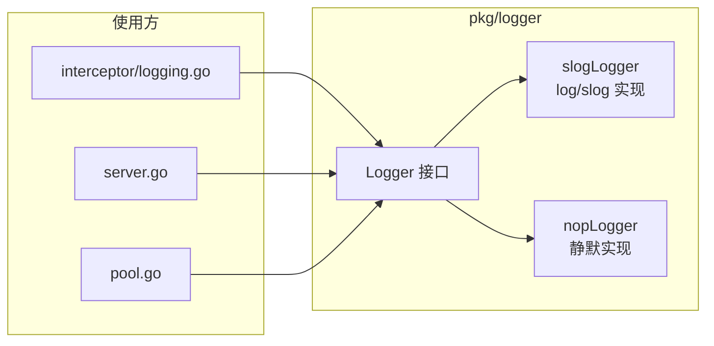

# 模块：Logger（日志）

## 职责

- 定义框架统一日志抽象接口 `Logger`，与具体实现解耦
- 提供基于 `log/slog`（Go 标准库，Go 1.21+）的默认实现，零外部依赖
- 提供 `Nop()` 静默实现，供不需要输出日志的组件使用（如连接池默认值）
- 被 `pkg/interceptor`、`pkg/server`、`pkg/pool` 等包引用，替换原有的 `fmt.Printf` 散落调用

**源码位置**：`pkg/logger/logger.go`

## 关键文件

| 文件 | 职责 |
|------|------|
| `pkg/logger/logger.go` | Logger 接口 + slogLogger + nopLogger |

---

## Logger 接口

```go
// pkg/logger/logger.go
type Logger interface {
    Debug(msg string, args ...any)
    Info(msg string, args ...any)
    Warn(msg string, args ...any)
    Error(msg string, args ...any)
    With(args ...any) Logger  // 返回携带固定字段的子 Logger
}
```

接口使用 `log/slog` 风格的 key-value 可变参数（`args ...any`），例如：

```go
l.Info("rpc call ok", "service", "Calculator", "method", "Add", "duration", 1*time.Millisecond)
// 输出：time=... level=INFO msg="rpc call ok" service=Calculator method=Add duration=1ms
```

---

## 构造函数

| 函数 | 说明 |
|------|------|
| `New()` | 默认 Logger：slog 文本格式，输出到 stderr，INFO 及以上级别 |
| `NewWithLevel(level slog.Level)` | 自定义最低日志级别（如 `slog.LevelDebug`）|
| `Nop()` | 静默 Logger，所有方法为空操作 |

```go
import (
    "log/slog"
    "RPCinGo/pkg/logger"
)

// 默认（INFO 级别，文本格式）
l := logger.New()

// DEBUG 级别（开发调试）
l := logger.NewWithLevel(slog.LevelDebug)

// 静默（不输出任何日志）
l := logger.Nop()
```

---

## 框架内集成点

| 组件 | 接入方式 | 默认行为 |
|------|---------|---------|
| `pkg/interceptor/logging.go` | `Logging(l logger.Logger)` | nil 时使用 `logger.New()` |
| `pkg/server` | `server.WithLogger(l)` Option | 不传时使用 `logger.New()` |
| `pkg/pool` | `pool.WithPoolLogger(l)` Option | 不传时使用 `logger.Nop()`（静默）|

### Server 注入

```go
srv := server.NewServer(
    server.WithAddress(":8080"),
    server.WithLogger(logger.NewWithLevel(slog.LevelDebug)), // 可选
)
```

### Pool 注入

```go
pool, _ := pool.NewConnectionPool("127.0.0.1:8080",
    pool.WithPoolLogger(logger.New()), // 显式启用连接池日志
)
```

### Logging 拦截器

```go
// 传入自定义 Logger，与框架其他组件共享同一实例
l := logger.New()
srv.Use(interceptor.Logging(l))
```

---

## 自定义实现

任何满足 `Logger` 接口的类型均可注入，例如适配 zap：

```go
type ZapLogger struct{ z *zap.SugaredLogger }

func (l *ZapLogger) Debug(msg string, args ...any) { l.z.Debugw(msg, args...) }
func (l *ZapLogger) Info(msg string, args ...any)  { l.z.Infow(msg, args...) }
func (l *ZapLogger) Warn(msg string, args ...any)  { l.z.Warnw(msg, args...) }
func (l *ZapLogger) Error(msg string, args ...any) { l.z.Errorw(msg, args...) }
func (l *ZapLogger) With(args ...any) logger.Logger {
    return &ZapLogger{l.z.With(args...)}
}

// 注入
srv := server.NewServer(server.WithLogger(&ZapLogger{zapSugar}))
```

---

## 图表



## 设计说明

- **零外部依赖**：`log/slog` 是 Go 1.21 标准库，不引入第三方包
- **接口最小化**：4 个级别 + `With`，覆盖 95% 的使用场景；用户按需适配 zap/zerolog
- **Pool 默认静默**：连接池的配置警告对大多数用户是噪音，默认 `Nop()`，需要时显式开启
- **Server 默认有声**：服务端心跳失败等事件需要被感知，默认 `logger.New()`

## Source References

- `pkg/logger/logger.go`
- `pkg/interceptor/logging.go`
- `pkg/server/options.go`
- `pkg/server/server.go`
- `pkg/pool/pool.go`
