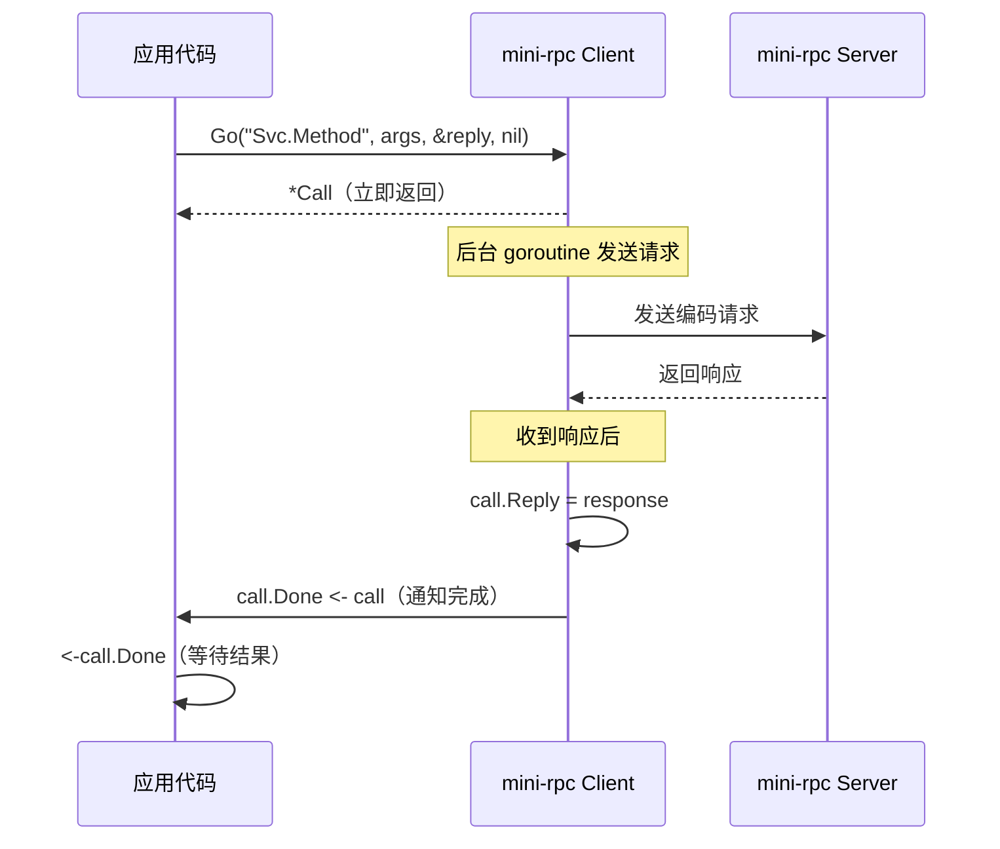

# 模块：mini-rpc（教学精简版）

## 职责

- 提供一个 ~1,500 行的**教学级 RPC 实现**，专注核心原理
- 演示 RPC 框架的最小可行实现：协议、编码、传输、服务端、客户端
- 额外提供 `Go()` 异步调用方法（生产版 `pkg/` 未暴露）
- 通过与 `pkg/` 对比，帮助学习者理解生产级框架的复杂性来源

## 关键文件

| 文件 | 职责 |
|------|------|
| `mini-rpc/protocol/` | 简单 Request/Response（无固定头，无 Metadata） |
| `mini-rpc/codec/` | 仅 JSON 编解码 |
| `mini-rpc/transport/` | 基础接口定义 |
| `mini-rpc/server/` | 最小化 Server（无拦截器链、无注册中心） |
| `mini-rpc/client/` | Client（含 Call() 和 Go() 异步方法） |
| `mini-rpc/examples/` | 简单示例 |

## mini-rpc vs pkg/ 功能对比

| 功能 | mini-rpc | pkg/（生产版） |
|------|---------|--------------|
| 协议头 | 无固定格式 | 20 字节固定头 + Magic |
| Metadata | 无 | 标准 key-value map |
| 编解码器 | 仅 JSON | JSON + Protobuf + Gzip |
| 错误码 | 字符串 | 11 个标准 ErrorCode |
| 异步调用 | `Go()` 方法 | 无（同步为主） |
| 连接池 | 无 | `pkg/pool/` |
| 服务发现 | 无 | etcd / memory |
| 负载均衡 | 无 | 4 种算法 |
| 熔断器 | 无 | 三状态 + 滑动窗口 |
| 限流器 | 无 | 令牌桶 + 滑动窗口 |
| 拦截器链 | 无 | Recovery/Logging/Metrics/RateLimit |
| 配置系统 | 无 | YAML + Builder |
| 代码量 | ~1,500 行 | ~10,900 行 |

## mini-rpc 协议格式

mini-rpc 使用**简单编码**，无固定头：

```
[4字节消息长度 BigEndian] + [JSON编码的 Request/Response]
```

vs 生产版：

```
[20字节固定头（Magic+Version+Codec+...+BodyLength）] + [编码后的 Body]
```

## 公共接口

### mini-rpc Client

```go
// 同步调用（与生产版 Call() 类似）
func (c *Client) Call(serviceMethod string, args interface{}, reply interface{}) error

// 异步调用（生产版未暴露）
func (c *Client) Go(serviceMethod string, args interface{}, reply interface{}, done chan *Call) *Call

// Call 结构（异步调用句柄）
type Call struct {
    ServiceMethod string
    Args          interface{}
    Reply         interface{}
    Error         error
    Done          chan *Call
}
```

### mini-rpc Server

```go
func (s *Server) Register(name string, rcvr interface{}) error
func (s *Server) Accept(lis net.Listener)
func (s *Server) ServeConn(conn net.Conn)
```

## 异步调用（Go()）实现原理



## 学习路径建议

建议按以下顺序阅读 mini-rpc 代码，理解 RPC 框架的核心原理：

1. **`mini-rpc/protocol/`**：理解 Request/Response 数据结构
2. **`mini-rpc/codec/`**：理解编解码原理（JSON 序列化）
3. **`mini-rpc/transport/`**：理解传输接口抽象
4. **`mini-rpc/server/`**：理解反射注册和请求路由
5. **`mini-rpc/client/`**：理解同步/异步调用机制
6. **迁移到 `pkg/`**：观察生产级功能如何在此基础上叠加

## 示例代码片段

**mini-rpc 服务端**：

```go
// 注册服务（与生产版相似）
srv := &server.Server{}
srv.Register("Arith", &ArithService{})
lis, _ := net.Listen("tcp", ":1234")
srv.Accept(lis)
```

**mini-rpc 同步调用**：

```go
cli, _ := client.Dial("tcp", "localhost:1234")
var reply int
err := cli.Call("Arith.Add", &Args{A: 1, B: 2}, &reply)
```

**mini-rpc 异步调用**：

```go
done := make(chan *client.Call, 1)
call := cli.Go("Arith.Add", &Args{A: 1, B: 2}, &reply, done)
// 做其他工作...
<-done
fmt.Println(call.Reply, call.Error)
```

## 边界情况

- **mini-rpc 不可用于生产**：无连接池（每次 Dial 新建连接）、无服务发现、无熔断保护
- **Go() 的 done 通道**：传 nil 时自动创建 buffered channel（容量 1），防止 goroutine 泄漏
- **字符串错误 vs ErrorCode**：mini-rpc 直接传字符串错误，无法被客户端程序化处理

## 测试

| 测试文件 | 内容 |
|---------|------|
| `mini-rpc/client/client_test.go` | 同步/异步调用 |
| `mini-rpc/codec/json_test.go` | JSON 编解码 |
| `mini-rpc/protocol/message_test.go` | 消息结构 |
| `mini-rpc/transport/tcp_test.go` | 传输层 |

## Source References

- `mini-rpc/protocol/`
- `mini-rpc/codec/`
- `mini-rpc/transport/`
- `mini-rpc/server/`
- `mini-rpc/client/`
- `mini-rpc/examples/`
- `mini-rpc/client/client_test.go`
- `wiki/mini-rpc/overview.md`
