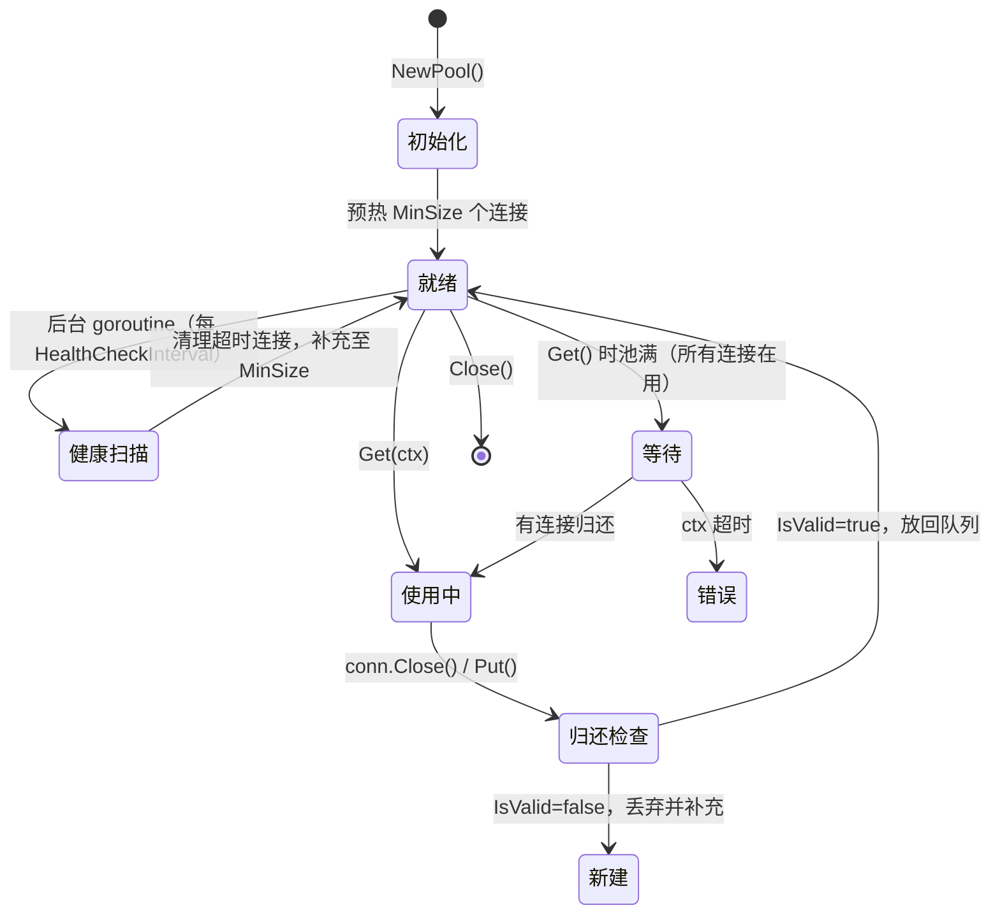

# 模块：Pool（连接池）

## 职责

- 提供 `ConnectionPool`：单地址 TCP 连接池（832 行），避免每次 RPC 建立新 TCP 连接的开销（握手约 1–3ms）
- 提供 `PoolManager`：多地址连接池管理器（112 行），双重检查锁延迟创建
- 提供 `PooledConnection`：包装真实连接，`Close()` 归还池而非真正关闭
- 支持 `ConnectionFactory` 和 `PoolValidator` 接口注入

**源码位置**：`pkg/pool/pool.go`（832 行）、`pkg/pool/pool_manager.go`（112 行）

## 关键文件

| 文件 | 行数 | 职责 |
|------|------|------|
| `pkg/pool/pool.go` | 832 | `ConnectionPool` 核心实现 |
| `pkg/pool/pool_manager.go` | 112 | `PoolManager` 多地址管理 |
| `pkg/pool/pool_conn.go` | — | `PooledConnection` 包装类 |

---

## PooledConnection

每个从连接池取出的连接被 `PooledConnection` 包装：

```go
type PooledConnection struct {
    *tcp.Client               // 底层 TCP 连接
    pool      *ConnectionPool
    createdAt time.Time       // 创建时间（用于 MaxLifetime 检查）
    lastUsed  time.Time       // 最后使用时间（用于 IdleTimeout 检查）
    inUse     bool            // 当前是否被借出
}
```

`Close()` 被覆盖：归还到池而非真正关闭：

```go
func (pc *PooledConnection) Close() error {
    pc.inUse = false
    pc.lastUsed = time.Now()
    return pc.pool.Put(pc)
}
```

---

## ConnectionPool

### 核心字段

```go
type ConnectionPool struct {
    address  string
    opts     PoolOptions

    conns    chan *PooledConnection  // 空闲连接队列（buffered channel）
    factory  ConnectionFactory       // 创建新连接的工厂
    validator PoolValidator          // 验证连接是否存活

    mu       sync.Mutex
    size     int     // 当前总连接数（含借出中的）
    closed   bool

    // 统计（原子操作）
    stats PoolStats
}
```

### PoolOptions 参数表

```go
type PoolOptions struct {
    MinSize             int           // 预创建最小连接数，默认 2
    MaxSize             int           // 最大连接数，默认 10
    IdleTimeout         time.Duration // 空闲超时，默认 60s（超时则关闭）
    MaxLifetime         time.Duration // 最长存活，默认 30min（到期强制关闭）
    HealthCheckInterval time.Duration // 后台健康检查间隔，默认 30s
    DialTimeout         time.Duration // 建立新连接超时，默认 5s
    ReadTimeout         time.Duration // 读超时，默认 30s
    WriteTimeout        time.Duration // 写超时，默认 30s
    Logger              logger.Logger // 日志实现，默认 logger.Nop()（静默）
}
```

可通过 `WithPoolLogger(l)` Option 注入：

```go
pool, _ := pool.NewConnectionPool("127.0.0.1:8080",
    pool.WithPoolLogger(logger.New()), // 启用连接池日志
)
```

连接池默认使用 `logger.Nop()` 静默运行，配置告警（如 MinSize > MaxSize/2）只在调用方传入 Logger 时才输出。

### ConnectionFactory 接口

连接创建逻辑通过工厂接口注入，实现连接池与传输实现解耦：

```go
type ConnectionFactory interface {
    Create(address string) (*tcp.Client, error)
}

// DefaultConnectionFactory：直接建立 TCP 连接
type DefaultConnectionFactory struct {
    opts ClientOptions
}
func (f *DefaultConnectionFactory) Create(addr string) (*tcp.Client, error) {
    c := tcp.NewClient(f.opts)
    return c, c.Dial(addr)
}

// RetryConnectionFactory：失败时指数退避重试
type RetryConnectionFactory struct {
    inner      ConnectionFactory
    maxRetries int
    baseDelay  time.Duration
}
func (f *RetryConnectionFactory) Create(addr string) (*tcp.Client, error) {
    delay := f.baseDelay
    for i := 0; i <= f.maxRetries; i++ {
        conn, err := f.inner.Create(addr)
        if err == nil {
            return conn, nil
        }
        time.Sleep(delay)
        delay *= 2 // 指数退避
    }
    return nil, ErrMaxRetriesExceeded
}
```

### PoolValidator 接口

```go
type PoolValidator interface {
    IsValid(conn *PooledConnection) bool
}

// 默认实现：检查 IdleTimeout + MaxLifetime + TCP 连接存活
type DefaultPoolValidator struct {
    idleTimeout time.Duration
    maxLifetime time.Duration
}

func (v *DefaultPoolValidator) IsValid(conn *PooledConnection) bool {
    now := time.Now()
    if v.idleTimeout > 0 && now.Sub(conn.lastUsed) > v.idleTimeout {
        return false
    }
    if v.maxLifetime > 0 && now.Sub(conn.createdAt) > v.maxLifetime {
        return false
    }
    return conn.IsConnected()
}
```

---

## 获取连接（Get）

```go
func (p *ConnectionPool) Get(ctx context.Context) (*PooledConnection, error) {
    for {
        select {
        case conn := <-p.conns: // 尝试从空闲队列取
            if p.validator.IsValid(conn) {
                conn.lastUsed = time.Now()
                conn.inUse = true
                atomic.AddInt64(&p.stats.GetCount, 1)
                return conn, nil
            }
            // 连接无效，丢弃并减少计数
            conn.Close()
            p.mu.Lock()
            p.size--
            p.mu.Unlock()

        default:
            p.mu.Lock()
            if p.size < p.opts.MaxSize {
                // 池未满，创建新连接
                p.size++
                p.mu.Unlock()
                conn, err := p.createConn()
                if err != nil {
                    p.mu.Lock()
                    p.size--
                    p.mu.Unlock()
                    return nil, err
                }
                atomic.AddInt64(&p.stats.CreateCount, 1)
                return conn, nil
            }
            p.mu.Unlock()

            // 池已满，等待有连接归还或 ctx 超时
            select {
            case conn := <-p.conns:
                if p.validator.IsValid(conn) {
                    conn.lastUsed = time.Now()
                    conn.inUse = true
                    return conn, nil
                }
            case <-ctx.Done():
                return nil, ctx.Err()
            }
        }
    }
}
```

## 归还连接（Put）

```go
func (p *ConnectionPool) Put(conn *PooledConnection) error {
    if p.closed {
        conn.Close()
        p.mu.Lock()
        p.size--
        p.mu.Unlock()
        return ErrPoolClosed
    }

    conn.inUse = false
    conn.lastUsed = time.Now()

    if !p.validator.IsValid(conn) {
        conn.Close()
        p.mu.Lock()
        p.size--
        p.mu.Unlock()
        atomic.AddInt64(&p.stats.CloseCount, 1)
        return nil
    }

    select {
    case p.conns <- conn:
        atomic.AddInt64(&p.stats.PutCount, 1)
    default:
        conn.Close()
        p.mu.Lock()
        p.size--
        p.mu.Unlock()
    }
    return nil
}
```

## 后台健康检查与预热

```go
func (p *ConnectionPool) start() {
    // 预热：创建 MinSize 个连接
    for i := 0; i < p.opts.MinSize; i++ {
        conn, err := p.createConn()
        if err == nil {
            p.conns <- conn
        }
    }

    // 后台健康检查
    go func() {
        ticker := time.NewTicker(p.opts.HealthCheckInterval)
        defer ticker.Stop()
        for {
            select {
            case <-ticker.C:
                p.healthCheck()
            case <-p.closeCh:
                return
            }
        }
    }()
}

func (p *ConnectionPool) healthCheck() {
    // 逐一检查空闲连接，有效放回，无效关闭
    for len(p.conns) > 0 {
        select {
        case conn := <-p.conns:
            if p.validator.IsValid(conn) {
                p.conns <- conn
            } else {
                conn.Close()
                p.mu.Lock()
                p.size--
                p.mu.Unlock()
            }
        default:
            goto done
        }
    }
done:
    // 补充到 MinSize
    p.mu.Lock()
    needed := p.opts.MinSize - p.size
    p.mu.Unlock()
    for i := 0; i < needed; i++ {
        if conn, err := p.createConn(); err == nil {
            p.conns <- conn
        }
    }
}
```

---

## PoolStats（统计）

```go
type PoolStats struct {
    GetCount    int64 // 成功 Get 次数
    PutCount    int64 // 成功 Put 次数
    CreateCount int64 // 新建连接次数
    CloseCount  int64 // 关闭连接次数
    WaitCount   int64 // 等待可用连接次数（池已满时）
}

// 连接复用率 = (GetCount - CreateCount) / GetCount，目标 > 95%
stats := pool.Stats()
fmt.Printf("复用率: %.1f%%\n",
    float64(stats.GetCount-stats.CreateCount)/float64(stats.GetCount)*100)
```

---

## PoolManager（多地址管理）

Discovery 模式下，Client 为每个服务实例地址维护独立连接池：

```go
// pkg/pool/pool_manager.go（112 行）
type PoolManager struct {
    pools   map[string]*ConnectionPool
    mu      sync.RWMutex
    opts    PoolOptions
    factory ConnectionFactory
}

// 双重检查锁定：快速路径（读锁）+ 慢速路径（写锁）
func (m *PoolManager) GetConnection(address string) (*PooledConnection, error) {
    m.mu.RLock()
    pool, ok := m.pools[address]
    m.mu.RUnlock()

    if !ok {
        m.mu.Lock()
        if pool, ok = m.pools[address]; !ok {
            pool = NewConnectionPool(address, m.opts, m.factory)
            m.pools[address] = pool
        }
        m.mu.Unlock()
    }

    return pool.Get(context.Background())
}

// 实例下线时调用：关闭该地址的连接池
func (m *PoolManager) RemovePool(address string) {
    m.mu.Lock()
    defer m.mu.Unlock()
    if pool, ok := m.pools[address]; ok {
        pool.Close()
        delete(m.pools, address)
    }
}

// 获取所有地址的连接池统计
func (m *PoolManager) Stats() map[string]PoolStats {
    m.mu.RLock()
    defer m.mu.RUnlock()
    stats := make(map[string]PoolStats, len(m.pools))
    for addr, pool := range m.pools {
        stats[addr] = pool.Stats()
    }
    return stats
}
```

---

## 图表



## 配置建议

| 场景 | MinSize | MaxSize | IdleTimeout |
|------|---------|---------|-------------|
| 低流量服务 | 2 | 10 | 60s |
| 中流量服务 | 5 | 50 | 90s |
| 高流量服务 | 10 | 100 | 120s |
| 极高流量（每实例）| 20 | 200 | 180s |

## 边界情况

- **池满且全部在用**：`Get(ctx)` 阻塞等待，直到有连接归还或 ctx 超时
- **MaxLifetime 到期**：即使连接健康也强制关闭，防止 TCP 连接过期的静默错误
- **PoolManager.RemovePool()**：实例下线时删除池并关闭所有连接
- **并发 Get/Put**：所有操作均在 mutex 保护下，线程安全

## 测试

| 测试文件 | 内容 |
|---------|------|
| `pkg/pool/pool_test.go` | 单池 Get/Put、IdleTimeout、MaxLifetime |
| `pkg/pool/pool_manager_test.go` | 多地址池创建、RemovePool、并发安全 |

## Source References

- `pkg/pool/pool.go`（832 行）
- `pkg/pool/pool_manager.go`（112 行）
- `pkg/pool/pool_conn.go`
- `pkg/pool/pool_test.go`
- `pkg/pool/pool_manager_test.go`
- `pkg/client/client.go`（使用方）
- `wiki/transport/connection-pool.md`
