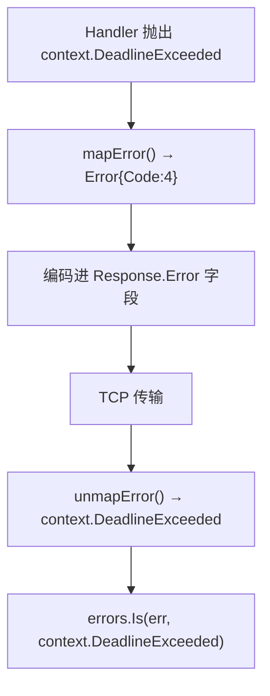
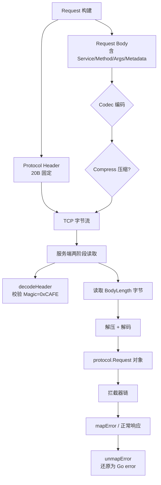

# 模块：Protocol（协议层）

> ⚠ 2026-06-02 重构：`Request.ID` 由传输层独占，`NewRequest` 不再赋 ID（发送前为 0）；`Header.Codec` 解码侧被遵守（按帧 codec）。详见 [深化重构记录](../guides/deepening-refactors.md)（C4）。

## 职责

- 定义 RPC 通信的**二进制协议格式**：20 字节固定头 + 变长体
- 提供 `Request`、`Response`、`Error`、`Metadata` 等核心数据结构
- 定义 `CodecType`、`CompressType`、`MessageType`、`ErrorCode` 枚举常量
- 提供协议头的序列化/反序列化（`encoding/binary` 大端字节序）

**源码位置**：`pkg/protocol/`

## 关键文件

| 文件 | 行数 | 职责 |
|------|------|------|
| `pkg/protocol/header.go` | — | 20 字节 Header 定义与编解码 |
| `pkg/protocol/request.go` | — | Request 结构体 + NewRequest |
| `pkg/protocol/response.go` | — | Response 结构体 |
| `pkg/protocol/error.go` | — | ErrorCode 枚举（11 个）+ Error 结构体 |
| `pkg/protocol/metadata.go` | — | Metadata 类型、方法、标准 Key 常量 |
| `pkg/protocol/pb/` | — | Protobuf 生成的协议消息 |

---

## 协议头（Header）

### 字节布局（20 字节，大端字节序）

```
字节偏移:  0    1    2    3    4    5    6    7
         ┌────┬────┬────┬────┬────┬────┬────┬────┐
         │  Magic(2B) │Ver │Type│Cdc │Cmp │  Reserved(2B)  │
         └────┴────┴────┴────┴────┴────┴────┴────┘

字节偏移:  8    9   10   11   12   13   14   15
         ┌────┬────┬────┬────┬────┬────┬────┬────┐
         │              RequestID (8B, uint64)    │
         └────┴────┴────┴────┴────┴────┴────┴────┘

字节偏移: 16   17   18   19
         ┌────┬────┬────┬────┐
         │   BodyLength (4B) │
         └────┴────┴────┴────┘
```

### 字段说明

| 字段 | 偏移 | 大小 | Go 类型 | 说明 |
|------|------|------|---------|------|
| `Magic` | 0 | 2 字节 | `uint16` | 魔数 `0xCAFE`，协议识别标志 |
| `Version` | 2 | 1 字节 | `uint8` | 协议版本，当前为 `1` |
| `MsgType` | 3 | 1 字节 | `MessageType` | Request=`1` / Response=`2` |
| `Codec` | 4 | 1 字节 | `CodecType` | 序列化格式 |
| `Compress` | 5 | 1 字节 | `CompressType` | 压缩算法 |
| `Reserved` | 6–7 | 2 字节 | `[2]byte` | 保留，当前全零，未来扩展 |
| `RequestID` | 8–15 | 8 字节 | `uint64` | 请求唯一 ID，客户端原子自增 |
| `BodyLength` | 16–19 | 4 字节 | `uint32` | Body 字节数，服务端按此读取 |

**总大小：20 字节（`HeaderSize` 常量）**

### 枚举值

```go
// MessageType
const (
    MessageTypeRequest  MessageType = 1
    MessageTypeResponse MessageType = 2
)

// CodecType
const (
    CodecTypeJSON     CodecType = 1
    CodecTypeProtobuf CodecType = 2
    CodecTypeMsgpack  CodecType = 3  // 预留，未完整实现
)

// CompressType
const (
    CompressTypeNone   CompressType = 0
    CompressTypeGzip   CompressType = 1
    CompressTypeSnappy CompressType = 2  // 预留
)
```

### 写入实现（ProtocolCodec.encodeHeader）

```go
// pkg/transport/tcp/codec.go
func encodeHeader(h *protocol.Header) []byte {
    buf := make([]byte, protocol.HeaderSize) // 20 字节
    binary.BigEndian.PutUint16(buf[0:2], h.Magic)
    buf[2] = h.Version
    buf[3] = byte(h.MsgType)
    buf[4] = byte(h.Codec)
    buf[5] = byte(h.Compress)
    // buf[6:8] 保留，已初始化为零
    binary.BigEndian.PutUint64(buf[8:16], h.RequestID)
    binary.BigEndian.PutUint32(buf[16:20], h.BodyLength)
    return buf
}
```

### 读取实现（ProtocolCodec.decodeHeader）

```go
func decodeHeader(buf []byte) (*protocol.Header, error) {
    magic := binary.BigEndian.Uint16(buf[0:2])
    if magic != protocol.Magic { // 0xCAFE
        return nil, fmt.Errorf("invalid magic number: 0x%X", magic)
    }
    return &protocol.Header{
        Magic:      magic,
        Version:    buf[2],
        MsgType:    protocol.MessageType(buf[3]),
        Codec:      protocol.CodecType(buf[4]),
        Compress:   protocol.CompressType(buf[5]),
        RequestID:  binary.BigEndian.Uint64(buf[8:16]),
        BodyLength: binary.BigEndian.Uint32(buf[16:20]),
    }, nil
}
```

### 设计决策

**为什么是固定 20 字节而非可变长头？**
固定长度头可以用单次 `io.ReadFull` 读取，无需解析分隔符，避免缓冲区复杂性。

**为什么 RequestID 是 8 字节（uint64）？**
在极高 QPS（1M req/s）下，溢出需要 584,000 年，实际上永不碰撞。

**为什么保留 2 字节？**
为将来扩展预留（如 Priority 字段、流控标志），不破坏当前解析代码。

---

## 消息格式（Request / Response）

### Request 结构

```go
// pkg/protocol/request.go
type Request struct {
    ID             uint64       // 请求唯一 ID，由全局原子计数器生成
    Service        string       // 目标服务名，如 "UserService"
    Method         string       // 目标方法名，如 "GetUser"
    ServiceVersion string       // 服务版本（可选），用于多版本路由
    Args           interface{}  // 请求参数，序列化前的 Go 对象
    Timeout        int64        // 超时时间（毫秒），0 = 不限
    IsStream       bool         // 是否流式（当前预留，默认 false）
    Metadata       Metadata     // 键值对元数据，随请求透传
    CreatedAt      int64        // 请求创建时间（Unix 毫秒）
    ArgsCodec      PayloadCodec // Args 字段的编码类型（JSON/Protobuf）
}
```

**请求 ID 生成机制**（原子自增，进程内唯一）：

```go
var globalID uint64

func NewRequest(service, method string, args interface{}) *Request {
    return &Request{
        ID:        atomic.AddUint64(&globalID, 1),
        Service:   service,
        Method:    method,
        Args:      args,
        CreatedAt: time.Now().UnixMilli(),
    }
}
```

**Timeout 语义**：由客户端填写，服务端可用此值设置 handler 的 deadline：

```go
deadline := time.UnixMilli(req.CreatedAt + req.Timeout)
ctx, cancel := context.WithDeadline(ctx, deadline)
defer cancel()
```

### Response 结构

```go
// pkg/protocol/response.go
type Response struct {
    ID         uint64       // 与对应 Request.ID 相同
    Data       interface{}  // 响应数据，Codec 解码后的 Go 对象
    Error      *Error       // 非 nil 表示调用失败
    Metadata   Metadata     // 服务端返回的元数据
    ServerTime int64        // 服务端处理完成时间（Unix 毫秒）
    DataCodec  PayloadCodec // Data 字段的编码类型
}

func (r *Response) IsSuccess() bool {
    return r.Error == nil || r.Error.Code == OK
}
```

### Payload Codec 区分

| 字段 | 描述 |
|------|------|
| `Header.Codec` | 整个消息体（Request/Response 结构）的序列化格式 |
| `Request.ArgsCodec` | 仅 `Args` 字段内容的序列化格式 |
| `Response.DataCodec` | 仅 `Data` 字段内容的序列化格式 |

这种双层编码允许：整个消息用 JSON 传输（兼容性好），但 Args/Data 内容用 Protobuf 编码（体积小）。

### 网络帧结构（JSON 编码示例）

```
TCP 字节流中的单个消息：
┌──────────────────────────────────────────────────────┐
│  Header（20 字节固定）                                │
│  0xCAFE │ ver=1 │ type=1 │ codec=1 │ compress=0 │... │
│  RequestID=42 │ BodyLength=156                       │
├──────────────────────────────────────────────────────┤
│  Body（156 字节，JSON 编码的 Request 结构体）          │
│  {"id":42,"service":"UserService","method":"GetUser" │
│   ,"args":{"user_id":1001},"timeout":5000,...}       │
└──────────────────────────────────────────────────────┘
```

---

## 错误码（ErrorCode）

### Error 结构体

```go
// pkg/protocol/error.go
type Error struct {
    Code    ErrorCode // 错误码枚举
    Message string    // 人类可读描述
}

func (e *Error) Error() string {
    return fmt.Sprintf("[%d] %s", e.Code, e.Message)
}
```

### 完整错误码列表

```go
type ErrorCode int32

const (
    OK                 ErrorCode = 0   // 成功
    Canceled           ErrorCode = 1   // 请求被客户端取消（context.Canceled）
    Unknown            ErrorCode = 2   // 未知错误
    InvalidArgument    ErrorCode = 3   // 参数非法（客户端错误，不应重试）
    DeadlineExceeded   ErrorCode = 4   // 超时（context.DeadlineExceeded）
    NotFound           ErrorCode = 5   // 资源不存在（服务/方法未注册）
    AlreadyExists      ErrorCode = 6   // 资源已存在
    PermissionDenied   ErrorCode = 7   // 无权限
    ResourceExhausted  ErrorCode = 8   // 资源耗尽（限流触发）
    Internal           ErrorCode = 13  // 服务端内部错误（panic、反射错误等）
    Unavailable        ErrorCode = 14  // 服务暂时不可用（熔断、过载）
)
```

> 错误码设计参考 gRPC Status Codes，数值与 gRPC 保持一致，便于未来互操作。

### 服务端错误映射（mapError）

```go
// pkg/server/error_map.go
func mapError(err error) *protocol.Error {
    if err == nil {
        return nil
    }
    switch {
    case errors.Is(err, ratelimiter.ErrRateLimitExceeded):
        return &protocol.Error{Code: protocol.ResourceExhausted, Message: err.Error()}
    case errors.Is(err, circuitbreaker.ErrCircuitOpen):
        return &protocol.Error{Code: protocol.Unavailable, Message: err.Error()}
    case errors.Is(err, context.Canceled):
        return &protocol.Error{Code: protocol.Canceled, Message: err.Error()}
    case errors.Is(err, context.DeadlineExceeded):
        return &protocol.Error{Code: protocol.DeadlineExceeded, Message: err.Error()}
    case errors.Is(err, ErrMethodNotFound), errors.Is(err, ErrServiceNotFound):
        return &protocol.Error{Code: protocol.NotFound, Message: err.Error()}
    default:
        return &protocol.Error{Code: protocol.Internal, Message: err.Error()}
    }
}
```

### 客户端错误还原（unmapError）

```go
// pkg/client/error_map.go
func unmapError(e *protocol.Error) error {
    if e == nil || e.Code == protocol.OK {
        return nil
    }
    switch e.Code {
    case protocol.Canceled:
        return context.Canceled
    case protocol.DeadlineExceeded:
        return context.DeadlineExceeded
    case protocol.NotFound:
        return fmt.Errorf("%w: %s", ErrMethodNotFound, e.Message)
    case protocol.Unavailable:
        return fmt.Errorf("%w: %s", ErrServiceUnavailable, e.Message)
    case protocol.ResourceExhausted:
        return fmt.Errorf("%w: %s", ErrRateLimitExceeded, e.Message)
    default:
        return fmt.Errorf("rpc error (code=%d): %s", e.Code, e.Message)
    }
}
```

### 错误传播路径



### 各错误码触发场景

| 错误码 | 触发场景 | 客户端应对 |
|--------|---------|-----------|
| `OK(0)` | 调用成功 | — |
| `Canceled(1)` | 客户端主动取消 ctx | 无需处理 |
| `Unknown(2)` | 未分类错误 | 记录日志，不重试 |
| `InvalidArgument(3)` | 参数校验失败 | 修复参数后重试 |
| `DeadlineExceeded(4)` | 超时 | 检查超时配置，幂等操作可重试 |
| `NotFound(5)` | 服务/方法未注册 | 检查服务名拼写 |
| `AlreadyExists(6)` | 重复创建资源 | 检查业务逻辑 |
| `PermissionDenied(7)` | 权限不足 | 检查 Token |
| `ResourceExhausted(8)` | 被限流 | 降低请求速率，退避重试 |
| `Internal(13)` | 服务端 panic/内部错误 | 报告 bug，不重试 |
| `Unavailable(14)` | 熔断/服务过载 | 退避重试，检查服务健康状态 |

---

## 编解码类型（Codec/Compress）

### CodecType 详细说明

| Codec | 数值 | 库 | 性能 | 适用场景 |
|-------|------|-----|------|---------|
| JSON | 1 | `encoding/json` | 中（~300ns 编码） | 开发调试、需人类可读 |
| Protobuf | 2 | `google.golang.org/protobuf` | 高（比 JSON 快 3–10x） | 生产高 QPS |
| MsgPack | 3 | 预留，未实现 | — | — |

### CompressType 详细说明

**Gzip 实现**（`pkg/codec/compress.go`）：

```go
type GzipCompressor struct {
    Level int // gzip.BestSpeed(1) ~ gzip.BestCompression(9), 默认 gzip.DefaultCompression(-1)
}

func (c *GzipCompressor) Compress(data []byte) ([]byte, error) {
    var buf bytes.Buffer
    w, _ := gzip.NewWriterLevel(&buf, c.Level)
    w.Write(data)
    w.Close()
    return buf.Bytes(), nil
}

func (c *GzipCompressor) Decompress(data []byte) ([]byte, error) {
    r, _ := gzip.NewReader(bytes.NewReader(data))
    defer r.Close()
    return io.ReadAll(r)
}
```

### Compressor 注册表

```go
// pkg/codec/compress.go
var compressors = map[protocol.CompressType]Compressor{
    protocol.CompressTypeNone: &NoneCompressor{},
    protocol.CompressTypeGzip: &GzipCompressor{Level: gzip.DefaultCompression},
}

func GetCompressor(t protocol.CompressType) Compressor {
    return compressors[t]
}
```

### 组合矩阵

| Codec | Compress | 适用场景 |
|-------|----------|---------|
| JSON | None | 开发调试、小消息 |
| JSON | Gzip | 大文本消息、带宽受限 |
| Protobuf | None | **生产高 QPS 推荐** |
| Protobuf | Gzip | 超大 Protobuf 消息 |

---

## Metadata（请求元数据）

### 类型定义

```go
// pkg/protocol/metadata.go
type Metadata map[string]string

func (m Metadata) Get(key string) string      // 获取值（键不存在返回空字符串）
func (m Metadata) Set(key, value string)      // 设置值
func (m Metadata) Clone() Metadata            // 深拷贝
func (m Metadata) Merge(other Metadata) Metadata // 合并（other 覆盖同名键）
```

### 标准键常量

```go
const (
    MetadataKeyTraceID = "trace-id"     // 分布式链路追踪 ID
    MetadataKeySpanID  = "span-id"      // 当前 Span ID
    MetadataKeyToken   = "x-token"      // 认证 Token
    MetadataKeyUserID  = "x-user-id"    // 调用方用户 ID
    MetadataKeyRegion  = "x-region"     // 区域（如 "us-east-1"）
    MetadataKeyZone    = "x-zone"       // 可用区（如 "az-a"）
    MetadataKeyDebug   = "x-debug"      // 调试模式（"true"/"false"）
)
```

### 使用示例

**客户端填写 Metadata**：

```go
req := protocol.NewRequest("UserService", "GetUser", args)
req.Metadata = protocol.Metadata{
    protocol.MetadataKeyTraceID: "550e8400-e29b-41d4-a716-446655440000",
    protocol.MetadataKeyToken:   "Bearer eyJhbGciOiJIUzI1NiJ9...",
    protocol.MetadataKeyUserID:  "1001",
    protocol.MetadataKeyRegion:  "cn-north-1",
}
```

**服务端拦截器读取 Metadata**（Logging 拦截器自动提取 trace-id）：

```go
func NewLoggingInterceptor(logger Logger) Interceptor {
    return func(ctx context.Context, req *protocol.Request, next Invoker) (interface{}, error) {
        traceID := req.Metadata.Get(protocol.MetadataKeyTraceID)
        start := time.Now()
        result, err := next(ctx, req)
        logger.Infof("[%s] %s.%s took %v err=%v",
            traceID, req.Service, req.Method, time.Since(start), err)
        return result, err
    }
}
```

**与 HTTP Header 的类比**：

| HTTP Header | RPCinGo Metadata Key |
|-------------|---------------------|
| `X-Trace-ID` | `MetadataKeyTraceID` |
| `Authorization` | `MetadataKeyToken` |
| `X-User-ID` | `MetadataKeyUserID` |
| `X-Region` | `MetadataKeyRegion` |

> 注意：Metadata 随每个请求序列化传输，避免放入大量数据（建议每个 key-value 不超过 1KB）。

## 图表



## 测试

| 测试文件 | 内容 |
|---------|------|
| `pkg/protocol/header_test.go` | Header 编解码正确性、Magic 校验 |
| `pkg/protocol/message_test.go` | Request/Response 序列化 |

## Source References

- `pkg/protocol/header.go`
- `pkg/protocol/request.go`
- `pkg/protocol/response.go`
- `pkg/protocol/error.go`
- `pkg/protocol/metadata.go`
- `pkg/protocol/pb/`
- `pkg/transport/tcp/codec.go`
- `pkg/server/error_map.go`
- `pkg/client/error_map.go`
- `pkg/codec/compress.go`
- `wiki/protocol/header.md`
- `wiki/protocol/message-format.md`
- `wiki/protocol/error-codes.md`
- `wiki/protocol/codec-types.md`
- `wiki/protocol/metadata.md`
