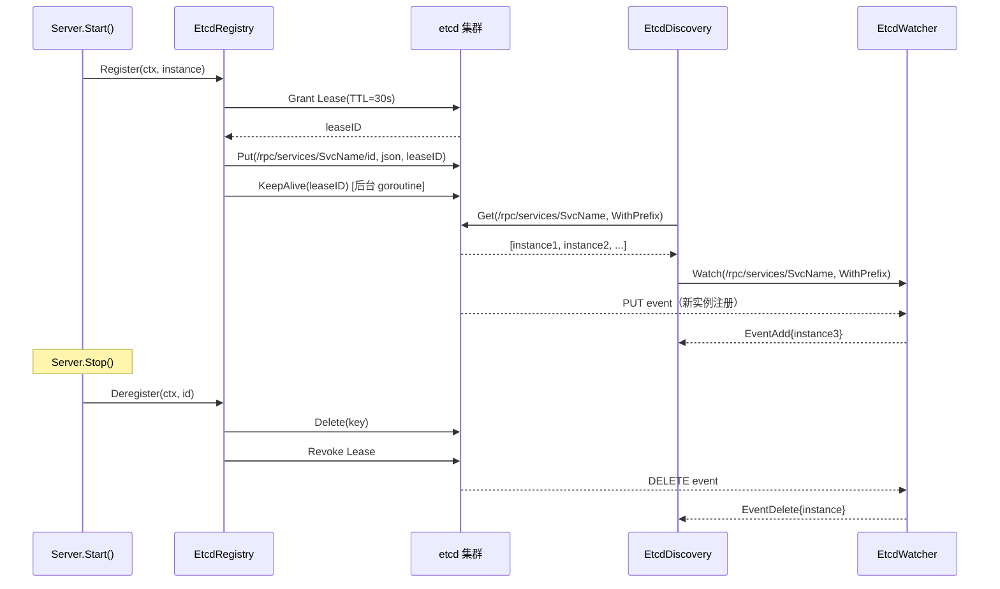

# 模块：Registry（服务注册与发现）

## 职责

- 定义 `Registry`（注册）和 `Discovery`（发现）两个独立接口
- 提供 **etcd 实现**：基于租约（Lease）的注册、KeepAlive 自动续约、Watch 实时推送
- 提供 **Memory 实现**：内存 map，同接口，适合单元测试和开发环境
- 定义 `ServiceInstance`（服务实例）和 `ServiceEvent`（变更事件）数据结构

**源码位置**：`pkg/registry/etcd/`（etcd.go 64行、registry.go 125行、discovery.go 88行、watcher.go 63行）

**依赖**：`go.etcd.io/etcd/client/v3 v3.6.7`

## 关键文件

| 文件 | 行数 | 职责 |
|------|------|------|
| `pkg/registry/registry.go` | — | 接口定义、ServiceInstance、ServiceEvent |
| `pkg/registry/etcd/etcd.go` | 64 | etcd 客户端配置初始化 |
| `pkg/registry/etcd/registry.go` | 125 | `EtcdRegistry` 注册/注销/心跳 |
| `pkg/registry/etcd/discovery.go` | 88 | `EtcdDiscovery` 查询实例 |
| `pkg/registry/etcd/watcher.go` | 63 | `EtcdWatcher` Watch 变更事件 |
| `pkg/registry/memory/memory.go` | — | `MemoryRegistry` 内存实现 |

---

## 接口定义

### Registry 接口

```go
// pkg/registry/registry.go
type Registry interface {
    Register(ctx context.Context, inst *ServiceInstance) error
    Deregister(ctx context.Context, service, instanceID string) error
    ListServices(ctx context.Context) ([]*ServiceInstance, error)
    Heartbeat(ctx context.Context, service, instanceID string) error
}
```

### Discovery 接口

```go
type Discovery interface {
    GetInstances(ctx context.Context, serviceName string) ([]*ServiceInstance, error)
    Watch(ctx context.Context, serviceName string) (Watcher, error)
}

type Watcher interface {
    Next() (*ServiceEvent, error)
    Stop() error
}
```

---

## ServiceInstance 结构

```go
type ServiceInstance struct {
    ID           string            // 实例唯一 ID（通常为 "service-host:port"）
    Service      string            // 服务名
    Version      string            // 服务版本（用于灰度发布）
    Address      string            // IP 地址
    Port         int               // 端口号
    Metadata     map[string]string // 扩展属性（如 zone, region）
    Weight       int               // 权重（加权负载均衡使用）
    Status       InstanceStatus    // 实例状态
    RegisterTime time.Time         // 注册时间
    UpdateTime   time.Time         // 最后更新时间
}

type InstanceStatus int

const (
    InstanceStatusUnknown InstanceStatus = iota
    InstanceStatusUp                     // 1：在线
    InstanceStatusDown                   // 2：下线
)

func (i *ServiceInstance) FullAddress() string {
    return fmt.Sprintf("%s:%d", i.Address, i.Port)
}
```

### ServiceEvent 结构

```go
type ServiceEvent struct {
    Type     EventType
    Instance *ServiceInstance
}

type EventType int

const (
    EventAdd    EventType = iota // 实例上线
    EventUpdate                  // 实例更新（权重、元数据变化）
    EventDelete                  // 实例下线
)
```

---

## etcd 实现

### 配置与初始化

```go
// pkg/registry/etcd/etcd.go（64 行）
type Config struct {
    Endpoints   []string      // etcd 节点地址列表
    DialTimeout time.Duration // 连接超时，默认 5s
    KeyPrefix   string        // Key 前缀，默认 "/rpc/services"
    LeaseTTL    int64         // 租约 TTL（秒），默认 30s
}

// 创建 Registry（服务端）
reg, err := etcd.NewRegistry(
    etcd.WithEndpoints("localhost:2379", "localhost:2380"),
    etcd.WithDialTimeout(5 * time.Second),
    etcd.WithKeyPrefix("/myapp/services"),
    etcd.WithLeaseTTL(30),
)

// 创建 Discovery（客户端）
disc, err := etcd.NewDiscovery(
    etcd.WithEndpoints("localhost:2379"),
    etcd.WithKeyPrefix("/myapp/services"),
)
```

### etcd Key 格式

```
{KeyPrefix}/{service}/{instanceID}
例：/rpc/services/UserService/10.0.0.1:8080
```

Value 是 `ServiceInstance` 的 JSON 序列化：

```json
{
  "id": "10.0.0.1:8080",
  "service": "UserService",
  "version": "1.0.0",
  "address": "10.0.0.1",
  "port": 8080,
  "metadata": {"region": "cn-north-1"},
  "weight": 1,
  "status": 1,
  "register_time": "2026-03-30T10:00:00Z"
}
```

### 服务注册实现（EtcdRegistry）

```go
// pkg/registry/etcd/registry.go（125 行）
type EtcdRegistry struct {
    client  *clientv3.Client
    config  Config
    leases  sync.Map // instanceID → clientv3.LeaseID
}

func (r *EtcdRegistry) Register(ctx context.Context, inst *registry.ServiceInstance) error {
    // 1. 申请租约（TTL 秒）
    leaseResp, err := r.client.Grant(ctx, r.config.LeaseTTL)
    if err != nil {
        return fmt.Errorf("etcd grant lease: %w", err)
    }

    // 2. 序列化实例信息
    inst.Status = registry.InstanceStatusUp
    inst.RegisterTime = time.Now()
    value, _ := json.Marshal(inst)

    // 3. 写入 etcd，绑定租约
    key := serviceKey(r.config.KeyPrefix, inst.Service, inst.ID)
    _, err = r.client.Put(ctx, key, string(value),
        clientv3.WithLease(leaseResp.ID))

    // 4. 保存 LeaseID
    r.leases.Store(inst.ID, leaseResp.ID)

    // 5. 启动 KeepAlive goroutine（每 TTL/3 秒自动续约）
    keepAliveCh, _ := r.client.KeepAlive(ctx, leaseResp.ID)
    go func() {
        for range keepAliveCh { /* 消费响应，防止 channel 堵塞 */ }
    }()

    return err
}
```

### KeepAlive vs Heartbeat

| 方式 | 触发者 | 频率 | 说明 |
|------|--------|------|------|
| `KeepAlive`（自动）| etcd client 内部 goroutine | 每 TTL/3 秒 | 注册时自动启动，无需外部调用 |
| `Heartbeat`（手动）| Server 心跳 goroutine | `HeartbeatInterval` | 调用 `KeepAliveOnce` 单次续约 |

```go
func (r *EtcdRegistry) Heartbeat(ctx context.Context,
    service, instanceID string) error {
    leaseID, ok := r.leases.Load(instanceID)
    if !ok {
        return registry.ErrNotFound
    }
    _, err := r.client.KeepAliveOnce(ctx, leaseID.(clientv3.LeaseID))
    return err
}
```

### 注销实现

```go
func (r *EtcdRegistry) Deregister(ctx context.Context,
    service, instanceID string) error {
    key := serviceKey(r.config.KeyPrefix, service, instanceID)
    _, err := r.client.Delete(ctx, key)
    if err != nil {
        return err
    }
    // 撤销租约（etcd 自动删除关联 Key）
    if leaseID, ok := r.leases.LoadAndDelete(instanceID); ok {
        r.client.Revoke(ctx, leaseID.(clientv3.LeaseID))
    }
    return nil
}
```

### 服务发现实现（EtcdDiscovery）

```go
// pkg/registry/etcd/discovery.go（88 行）
func (d *EtcdDiscovery) GetInstances(ctx context.Context,
    service string) ([]*registry.ServiceInstance, error) {

    // 前缀查询：获取该服务所有实例
    prefix := servicePrefix(d.config.KeyPrefix, service)
    resp, err := d.client.Get(ctx, prefix, clientv3.WithPrefix())
    if err != nil {
        return nil, fmt.Errorf("etcd get: %w", err)
    }

    // 解析并过滤（只返回 Up 状态）
    instances := make([]*registry.ServiceInstance, 0, len(resp.Kvs))
    for _, kv := range resp.Kvs {
        var inst registry.ServiceInstance
        if err := json.Unmarshal(kv.Value, &inst); err != nil {
            continue // 跳过损坏的数据
        }
        if inst.Status == registry.InstanceStatusUp {
            instances = append(instances, &inst)
        }
    }
    return instances, nil
}
```

### Watch 实现（EtcdWatcher）

```go
// pkg/registry/etcd/watcher.go（63 行）
type EtcdWatcher struct {
    watchChan clientv3.WatchChan
    cancel    context.CancelFunc
}

func (w *EtcdWatcher) Next() (*registry.ServiceEvent, error) {
    resp, ok := <-w.watchChan
    if !ok {
        return nil, registry.ErrWatcherStopped
    }
    for _, event := range resp.Events {
        var inst registry.ServiceInstance
        json.Unmarshal(event.Kv.Value, &inst)

        eventType := registry.EventAdd
        switch event.Type {
        case clientv3.EventTypeDelete:
            eventType = registry.EventDelete
        case clientv3.EventTypePut:
            if event.IsCreate() {
                eventType = registry.EventAdd
            } else {
                eventType = registry.EventUpdate
            }
        }
        return &registry.ServiceEvent{Type: eventType, Instance: &inst}, nil
    }
    return w.Next() // 递归处理空事件
}
```

---

## Memory 实现（测试用）

```go
// pkg/registry/memory/memory.go
type MemoryRegistry struct {
    mu        sync.RWMutex
    services  map[string]map[string]*registry.ServiceInstance
    // service → instanceID → instance
    watchers  map[string][]chan *registry.ServiceEvent
}

func (r *MemoryRegistry) Register(ctx context.Context,
    inst *registry.ServiceInstance) error {
    r.mu.Lock()
    defer r.mu.Unlock()
    // ... 存入内存，通知 Watch channel
}

func (r *MemoryRegistry) Watch(ctx context.Context,
    service string) (registry.Watcher, error) {
    // 创建独立 channel，注册变更时推送
}
```

### etcd 实现 vs Memory 实现

| 特性     | etcd 实现              | Memory 实现    |
| ------ | -------------------- | ------------ |
| 持久化    | etcd 集群（TTL 控制）      | 进程内存         |
| 高可用    | 依赖 etcd 集群           | 进程生命周期       |
| TTL/续约 | 租约 + KeepAlive       | 无过期          |
| Watch  | etcd Watch API（实时推送） | 内存事件 channel |
| 适用场景   | 生产微服务                | 单元测试、开发调试    |
| 外部依赖   | etcd 集群              | 无            |

---

## 图表



## 边界情况

- **etcd 不可用时**：`Register` 返回错误，服务启动应失败而非忽略
- **租约到期**：KeepAlive goroutine 崩溃时，服务实例会在 TTL 后自动从 etcd 消失
- **Watch channel 关闭**：etcd 断连时 channel 关闭，Client 的 Watch goroutine 应重连
- **同一 ID 重复注册**：会覆盖 etcd 中的 Key（幂等），不报错
- **GetInstances 只过滤 StatusUp**：StatusDown 的实例不参与负载均衡

## 测试

| 测试文件 | 内容 |
|---------|------|
| `pkg/registry/etcd/etcd_test.go` | etcd 注册/发现/Watch 集成测试（需运行 etcd）|
| `pkg/registry/memory/memory_test.go` | Memory 实现功能测试 |

## Source References

- `pkg/registry/registry.go`
- `pkg/registry/etcd/etcd.go`（64 行）
- `pkg/registry/etcd/registry.go`（125 行）
- `pkg/registry/etcd/discovery.go`（88 行）
- `pkg/registry/etcd/watcher.go`（63 行）
- `pkg/registry/memory/memory.go`
- `pkg/registry/etcd/etcd_test.go`
- `pkg/registry/memory/memory_test.go`
- `wiki/registry/overview.md`
- `wiki/registry/etcd.md`
- `wiki/registry/memory.md`
