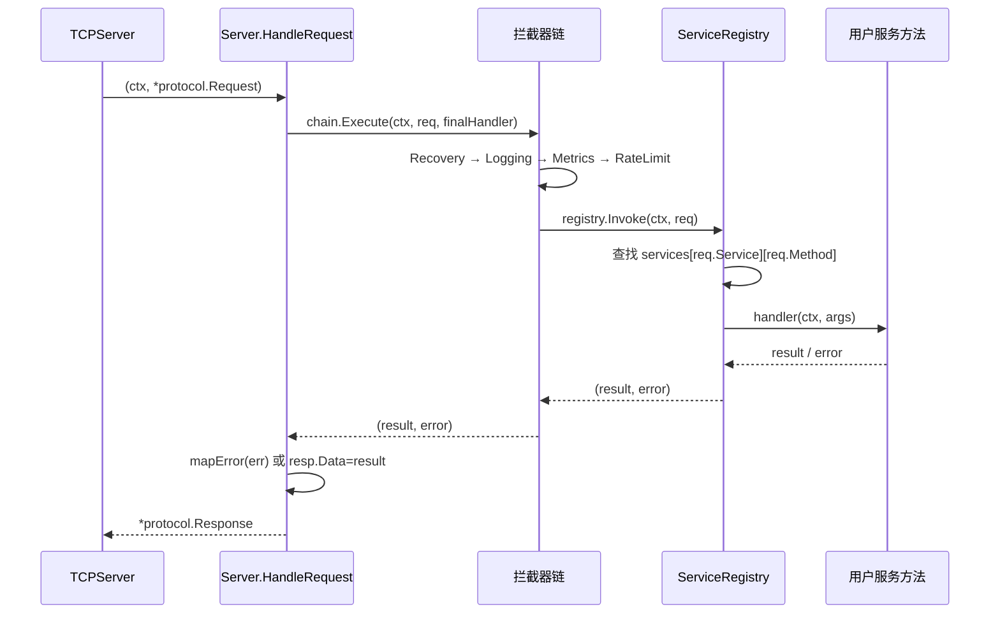

# 模块：Server（服务端）

> ⚠ 2026-06-02 重构：新增 `server.WithHandlerTimeout` 与 `server.WithTransportOptions(...)` 直通，每个 transport 旋钮经单一构造器可达；`tcp.Server.Options()` 可查生效值。详见 [深化重构记录](../guides/deepening-refactors.md)（C3）。

## 职责

- 监听 TCP 端口、处理请求、路由到 handler
- 管理服务注册（`RegisterService`）：通过反射自动发现三种签名的公开方法
- 执行拦截器链（Recovery → Logging → Metrics → RateLimit → Handler）
- 集成 etcd Registry，支持服务启动/停止时自动注册/注销和心跳

**源码位置**：`pkg/server/server.go`（197 行）、`pkg/server/service.go`（311 行）、`pkg/server/options.go`（87 行）

## 关键文件

| 文件 | 行数 | 职责 |
|------|------|------|
| `pkg/server/server.go` | 197 | Server 主体：启动、停止、请求路由 |
| `pkg/server/service.go` | 311 | ServiceRegistry、方法反射注册 |
| `pkg/server/options.go` | 87 | serverOptions 定义与 WithXxx 函数 |
| `pkg/server/error_map.go` | — | mapError：Go error → protocol.Error |

---

## Server 核心结构

```go
// pkg/server/server.go
type Server struct {
    opts serverOptions

    transport *tcp.Server           // TCP 传输层
    registry  *ServiceRegistry      // 方法路由表
    chain     *interceptor.Chain    // 拦截器链
    reg       registry.Registry     // 服务注册中心（可选）
    codec     codec.Codec           // 编解码器（含压缩时用 CompressedCodec）

    // 生命周期管理
    ctx    context.Context
    cancel context.CancelFunc
    wg     sync.WaitGroup
}
```

---

## ServerOptions 参数表

```go
// pkg/server/options.go（87 行）
type serverOptions struct {
    address           string
    codec             protocol.CodecType
    compress          protocol.CompressType
    readTimeout       time.Duration
    writeTimeout      time.Duration
    maxConcurrent     int
    workerPoolSize    int
    interceptors      []interceptor.Interceptor

    // 服务注册相关
    registryEnabled   bool
    registry          registry.Registry
    serviceName       string
    serviceVersion    string
    serviceWeight     int
    serviceMetadata   map[string]string
    heartbeatInterval int // 秒
}

// 默认值
func defaultServerOptions() serverOptions {
    return serverOptions{
        address:           ":8080",
        codec:             protocol.CodecTypeJSON,
        compress:          protocol.CompressTypeNone,
        readTimeout:       30 * time.Second,
        writeTimeout:      30 * time.Second,
        maxConcurrent:     10000,
        workerPoolSize:    100,
        heartbeatInterval: 10,
    }
}
```

| Option 函数 | 说明 |
|-------------|------|
| `WithAddress(addr)` | 监听地址，如 `":8080"` |
| `WithCodec(codec, compress)` | 序列化格式与压缩算法 |
| `WithTimeout(read, write)` | 读写超时 |
| `WithConcurrency(max, pool)` | 最大并发请求数与 Worker Pool 大小 |
| `WithInterceptors(...)` | 拦截器列表（Recovery 建议放第一位）|
| `WithRateLimit(limiter)` | 限流器，自动 prepend 到拦截器链最前，超限直接拒绝 |
| `WithRegistry(name, ver, reg)` | 服务注册中心、服务名和版本 |
| `WithHeartbeatInterval(d)` | 心跳间隔（默认 5s）|
| `WithLogger(l)` | 注入 `logger.Logger`（来自 `pkg/logger`），默认使用 `logger.New()`（slog 文本输出）|

---

## 生命周期

```
NewServer(options...)
    │
    ├── 应用 Options，设置默认值
    ├── 初始化 ServiceRegistry
    ├── 初始化 InterceptorChain
    ├── 选择 Codec（含压缩时用 CompressedCodec 装饰器）
    └── 初始化 TCPServer

Start(ctx) ── 阻塞
    │
    ├── 若 registryEnabled：
    │   ├── reg.Register(ctx, &ServiceInstance{
    │   │       Service: serviceName,
    │   │       Address: host, Port: port,
    │   │       Version: serviceVersion, Weight: serviceWeight,
    │   │       Status:  InstanceStatusUp,
    │   │   })
    │   └── 启动心跳 goroutine：
    │       每 heartbeatInterval 秒调用 reg.Heartbeat(ctx, serviceName, instanceID)
    │
    └── tcpServer.Listen(address)
        tcpServer.Serve(s.HandleRequest) ← 阻塞

Stop()
    ├── stopHeartbeatOne.Do(close(stopHeartbeat))
    │   // sync.Once 保护，幂等关闭，防止 double-Stop() 引发 panic
    ├── tcpServer.Close()   // 关闭监听器，停止接受新连接
    ├── wg.Wait()           // 等待进行中的请求完成
    └── 若 registryEnabled：
        reg.Deregister(ctx, serviceName, instanceID)
```

---

## 请求处理（HandleRequest）

```go
func (s *Server) HandleRequest(ctx context.Context,
    req *protocol.Request) (*protocol.Response, error) {

    // 通过拦截器链调用实际 handler
    result, err := s.chain.Execute(ctx, req,
        func(ctx context.Context, req *protocol.Request) (interface{}, error) {
            return s.registry.Invoke(ctx, req)
        })

    // 构建 Response
    resp := &protocol.Response{
        ID:         req.ID,
        ServerTime: time.Now().UnixMilli(),
    }

    if err != nil {
        resp.Error = mapError(err) // pkg/server/error_map.go
    } else {
        resp.Data = result
    }

    // 将 TracingServer 拦截器写入 req.Metadata 的 SpanID 回写到 Response
    // 客户端通过 rpcResp.GetMetadata("span-id") 即可读取服务端 SpanID
    if spanID, ok := req.GetMetadata(protocol.MetaKeySpanID); ok && spanID != "" {
        resp.SetMetadata(protocol.MetaKeySpanID, spanID)
    }
    return resp, nil
}
```

---

## 服务注册（ServiceRegistry）

### 数据结构

```go
// pkg/server/service.go（311 行）
type ServiceRegistry struct {
    services map[string]*Service
    mu       sync.RWMutex
}

type Service struct {
    name    string
    methods map[string]*MethodInfo
}

type MethodInfo struct {
    handler MethodHandler
    reqType reflect.Type // 请求参数类型（用于反序列化）
}

type MethodHandler func(ctx context.Context, args interface{}) (interface{}, error)
```

### 三种合法方法签名

| 签名类型 | 形式 | 适用场景 |
|---------|------|---------|
| 签名 1：简单 | `func (s *Svc) Method(args interface{}) error` | 不需要 ctx/返回值的简单操作 |
| 签名 2：标准 ctx | `func (s *Svc) Method(ctx context.Context, args interface{}) error` | 需要 ctx 访问的操作 |
| 签名 3：强类型（推荐）| `func (s *Svc) Method(ctx context.Context, req *TypedReq) (*TypedResp, error)` | 生产场景，类型安全 |

### 反射注册实现

```go
func (r *ServiceRegistry) RegisterService(name string, impl interface{}) error {
    t := reflect.TypeOf(impl)
    v := reflect.ValueOf(impl)

    svc := &Service{name: name, methods: make(map[string]*MethodInfo)}

    for i := 0; i < t.NumMethod(); i++ {
        method := t.Method(i)
        if !method.IsExported() {
            continue // 跳过未导出方法
        }

        handler, reqType, ok := makeHandler(v, method)
        if !ok {
            continue // 签名不匹配，静默跳过（不报错）
        }

        svc.methods[method.Name] = &MethodInfo{
            handler: handler,
            reqType: reqType,
        }
    }

    r.mu.Lock()
    r.services[name] = svc
    r.mu.Unlock()
    return nil
}
```

### 签名 3 的 makeHandler 实现

```go
func makeHandler(v reflect.Value, method reflect.Method) (MethodHandler, reflect.Type, bool) {
    mt := method.Type

    // 签名 3：func(ctx, *TypedReq) (*TypedResp, error)
    if mt.NumIn() == 3 && mt.NumOut() == 2 {
        ctxType := mt.In(1)
        reqType := mt.In(2)
        if ctxType.Implements(contextInterface) &&
            reqType.Kind() == reflect.Ptr &&
            mt.Out(1).Implements(errorInterface) {

            handler := func(ctx context.Context, args interface{}) (interface{}, error) {
                req := reflect.New(reqType.Elem())
                if err := unmarshalArgs(args, req.Interface(), reqType); err != nil {
                    return nil, err
                }
                out := method.Func.Call([]reflect.Value{v, reflect.ValueOf(ctx), req})
                if !out[1].IsNil() {
                    return nil, out[1].Interface().(error)
                }
                return out[0].Interface(), nil
            }
            return handler, reqType, true
        }
    }
    // ... 签名 1、2 类似处理
    return nil, nil, false
}
```

### 自动 Protobuf/JSON 检测

```go
func unmarshalArgs(args interface{}, req interface{}, reqType reflect.Type) error {
    // 检测是否为 proto.Message
    if protoMsg, ok := req.(proto.Message); ok {
        if data, ok := args.([]byte); ok {
            return proto.Unmarshal(data, protoMsg)
        }
    }
    // 否则用 JSON 反序列化（args 可能是 map，先转 JSON bytes）
    data, err := json.Marshal(args)
    if err != nil {
        return err
    }
    return json.Unmarshal(data, req)
}
```

### 请求路由（Invoke）

```go
func (r *ServiceRegistry) Invoke(ctx context.Context,
    req *protocol.Request) (interface{}, error) {

    r.mu.RLock()
    svc, ok := r.services[req.Service]
    r.mu.RUnlock()

    if !ok {
        return nil, fmt.Errorf("%w: %s", ErrServiceNotFound, req.Service)
    }

    info, ok := svc.methods[req.Method]
    if !ok {
        return nil, fmt.Errorf("%w: %s.%s", ErrMethodNotFound, req.Service, req.Method)
    }

    return info.handler(ctx, req.Args)
}
```

---

## 完整启动示例

```go
package main

import (
    "context"
    "log"
    "net/http"
    "os"
    "os/signal"
    "syscall"

    "RPCinGo/pkg/interceptor"
    "RPCinGo/pkg/protocol"
    "RPCinGo/pkg/ratelimiter"
    "RPCinGo/pkg/registry/etcd"
    "RPCinGo/pkg/server"
    "github.com/prometheus/client_golang/prometheus/promhttp"
)

func main() {
    reg, _ := etcd.NewRegistry(etcd.WithEndpoints("localhost:2379"))
    limiter := ratelimiter.NewTokenBucket(10000, 500)

    srv := server.NewServer(
        server.WithAddress(":8080"),
        server.WithCodec(protocol.CodecTypeProtobuf, protocol.CompressTypeNone),
        server.WithTimeout(30*time.Second, 30*time.Second),
        server.WithMaxConcurrent(5000),
        server.WithRegistry(reg, "UserService"),
        server.WithServiceVersion("1.0.0"),
        server.WithServiceWeight(1),
        server.WithHeartbeatInterval(10),
        server.WithInterceptors(
            interceptor.NewRecoveryInterceptor(),    // 最外层
            interceptor.NewLoggingInterceptor(nil),
            interceptor.NewMetricsInterceptor(),
            interceptor.NewRateLimitInterceptor(limiter),
        ),
    )

    srv.RegisterService("UserService", &UserService{})

    go func() {
        http.Handle("/metrics", promhttp.Handler())
        http.ListenAndServe(":9090", nil)
    }()

    go func() {
        sig := make(chan os.Signal, 1)
        signal.Notify(sig, syscall.SIGINT, syscall.SIGTERM)
        <-sig
        srv.Stop()
    }()

    log.Fatal(srv.Start(context.Background()))
}
```

## 图表



## 注意事项

- **Recovery 必须是第一个拦截器**：确保任何 panic 都被捕获，包括后续拦截器中的 panic
- **方法名大小写敏感**：`GetUser` 和 `getUser` 是不同方法
- **同名服务覆盖**：`RegisterService` 多次调用同名服务，新注册覆盖旧注册（无警告）
- **签名不匹配时静默跳过**：不符合三种签名的方法被忽略（注意检查日志）
- **未导出方法不注册**：`func (s *Service) privateMethod()` 不会被注册

## 测试

| 测试文件 | 内容 |
|---------|------|
| `pkg/server/server_test.go` | 启动/停止、请求路由、超时处理 |
| `pkg/server/service_typed_test.go` | 强类型 Protobuf 服务注册与调用 |

## Source References

- `pkg/server/server.go`（197 行）
- `pkg/server/service.go`（311 行）
- `pkg/server/options.go`（87 行）
- `pkg/server/error_map.go`
- `pkg/interceptor/interceptor.go`
- `wiki/server/overview.md`
- `wiki/server/service-registration.md`
- `wiki/server/interceptors.md`
