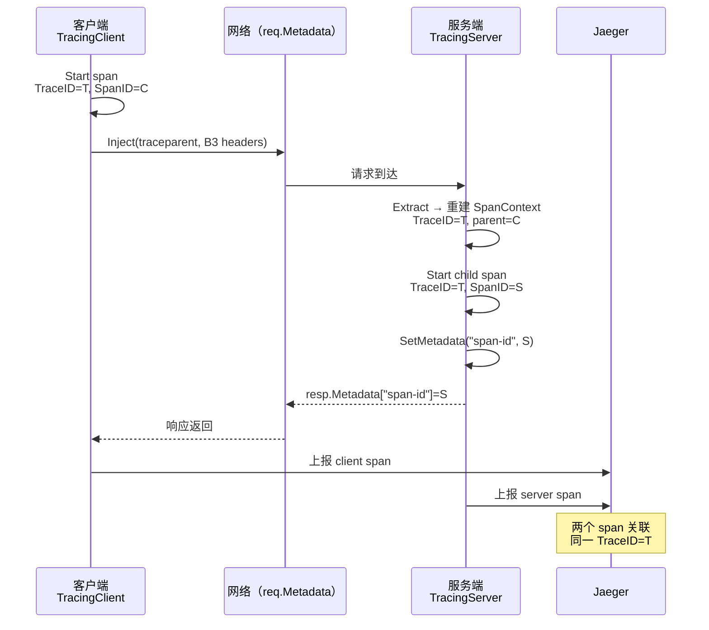

# 模块：Tracing（分布式追踪）

## 职责

- 封装 OpenTelemetry SDK 初始化（TracerProvider + Jaeger Exporter）
- 提供全局 `tracer`，供拦截器创建 span
- 配置 W3C TraceContext + B3 多头格式的 TextMapPropagator
- 提供辅助函数 `TraceID()` 从 context 提取 TraceID 字符串（供 Logging 拦截器使用）

**源码位置**：`pkg/tracing/tracing.go`（51 行）

---

## 关键文件

| 文件 | 职责 |
|------|------|
| `pkg/tracing/tracing.go` | `InitTracerProvider`、`Start`、`TraceID` 三个公开函数 |
| `pkg/interceptor/tracing.go` | `TracingClient` / `TracingServer` 拦截器 + `metadataCarrier` 适配器 |

---

## 公开 API

| 函数 | 签名 | 说明 |
|------|------|------|
| `InitTracerProvider` | `(jaegerURL, serviceName string) (func(ctx) error, error)` | 初始化全局 TracerProvider，返回 shutdown 回调 |
| `Start` | `(ctx context.Context, name string) (context.Context, trace.Span)` | 创建并启动一个 span |
| `TraceID` | `(ctx context.Context) string` | 从 context 提取 TraceID 字符串，无效时返回 `""` |

---

## 初始化流程

```go
// 服务端 / 客户端 main() 各调一次
shutdown, err := tracing.InitTracerProvider(
    "http://localhost:14268/api/traces",  // Jaeger Collector HTTP 地址
    "order-service",                      // 服务名（显示在 Jaeger UI）
)
if err != nil {
    log.Fatal(err)
}
defer shutdown(context.Background())
```

`InitTracerProvider` 内部完成：
1. 创建 Jaeger HTTP Exporter（批量上报 spans）
2. 创建 `TracerProvider`，绑定 `semconv.ServiceNameKey` resource
3. 设置全局 `otel.SetTracerProvider(tp)`
4. 配置 `CompositeTextMapPropagator`（TraceContext + Baggage + B3MultipleHeader）

---

## 追踪上下文传播

### metadataCarrier

`pkg/interceptor/tracing.go` 定义了一个桥接类型，使 `protocol.Metadata`（`map[string]string`）满足 OTel 的 `TextMapCarrier` 接口：

```go
type metadataCarrier protocol.Metadata

func (m metadataCarrier) Get(key string) string {
    result, _ := protocol.Metadata(m).Get(key)
    return result
}
func (m metadataCarrier) Set(key, value string) { protocol.Metadata(m).Set(key, value) }
func (m metadataCarrier) Keys() []string { /* 遍历 map */ }
```

### 传播流程

```
客户端 TracingClient                        服务端 TracingServer
─────────────────                           ────────────────────
ctx, span := tracing.Start(ctx, "rpc.client/...")
otel.GetTextMapPropagator().Inject(ctx,     ← req.Metadata 作为 carrier
    metadataCarrier(req.Metadata))
  → 写入:                                   otel.GetTextMapPropagator().Extract(ctx,
    traceparent: 00-<TraceID>-<SpanID>-01       metadataCarrier(req.Metadata))
    X-B3-TraceId: <TraceID>               → 重建远端 SpanContext（TraceID 相同）
    X-B3-SpanId: <ClientSpanID>           ctx, span := tracing.Start(ctx, "rpc.server/...")
                                          → 新 span 自动以 ClientSpan 为 parent
```

结果：客户端 span 和服务端 span 共享同一 TraceID，在 Jaeger 中显示为父子关系。

---

## 拦截器实现

### TracingClient

```go
// pkg/interceptor/tracing.go
func TracingClient() Interceptor {
    return func(ctx context.Context, req *protocol.Request, invoker Invoker) (any, error) {
        ctx, span := tracing.Start(ctx, "rpc.client/"+req.Service+"/"+req.Method)
        defer span.End()

        span.SetAttributes(
            attribute.String("rpc.service", req.Service),
            attribute.String("rpc.method", req.Method),
        )
        // 将 span context 注入 req.Metadata（W3C traceparent + B3 headers）
        otel.GetTextMapPropagator().Inject(ctx, metadataCarrier(req.Metadata))

        result, err := invoker(ctx, req)
        if err != nil {
            span.RecordError(err)
            span.SetStatus(codes.Error, err.Error())
        }
        return result, err
    }
}
```

### TracingServer

```go
func TracingServer() Interceptor {
    return func(ctx context.Context, req *protocol.Request, invoker Invoker) (any, error) {
        // 从 req.Metadata 提取客户端注入的 trace context
        ctx = otel.GetTextMapPropagator().Extract(ctx, metadataCarrier(req.Metadata))
        ctx, span := tracing.Start(ctx, "rpc.server/"+req.Service+"/"+req.Method)
        defer span.End()

        // 将服务端 SpanID 写回 req.Metadata，供 HandleRequest 复制到 Response
        req.SetMetadata(protocol.MetaKeySpanID, span.SpanContext().SpanID().String())

        result, err := invoker(ctx, req)
        if err != nil {
            span.RecordError(err)
            span.SetStatus(codes.Error, err.Error())
        }
        return result, err
    }
}
```

---

## 图表



---

## 与 Logging 的联动

`Logging` 拦截器通过 `tracing.TraceID(ctx)` 提取 TraceID 注入日志：

```go
// pkg/interceptor/logging.go
traceID := tracing.TraceID(ctx)
// 输出：
// [INFO] → RPC call: [Calculator.Add] trace=4c3c157dbbd2231805393fbf8066267e
```

这使得在日志管理系统中可以直接用 TraceID 关联 Jaeger 调用链。

---

## 配置要求

| 依赖 | 版本 | 说明 |
|------|------|------|
| `go.opentelemetry.io/otel` | v1.x | 核心 SDK |
| `go.opentelemetry.io/otel/exporters/jaeger` | v1.x | Jaeger HTTP Exporter |
| `go.opentelemetry.io/contrib/propagators/b3` | v1.x | B3 多头格式传播 |
| Jaeger（外部服务）| any | 接收端口 `14268`（HTTP Collector） |

启动 Jaeger：
```bash
docker run -p 14268:14268 -p 16686:16686 jaegertracing/all-in-one
```

---

## Update Notes

- 2026-04-04：新增此页面，覆盖 `pkg/tracing/` 包（`InitTracerProvider`、`Start`、`TraceID`）及 `pkg/interceptor/tracing.go` 中的 `metadataCarrier` 适配器实现。

## Source References

- `pkg/tracing/tracing.go`
- `pkg/interceptor/tracing.go`
- `pkg/interceptor/logging.go`
- `pkg/protocol/metadata.go`
- `pkg/server/server.go`（HandleRequest 中 SpanID 回写）
- `examples/calculator/server/main.go`
- `examples/calculator/client/main.go`
- `deepwiki/guides/telemetry.md`
