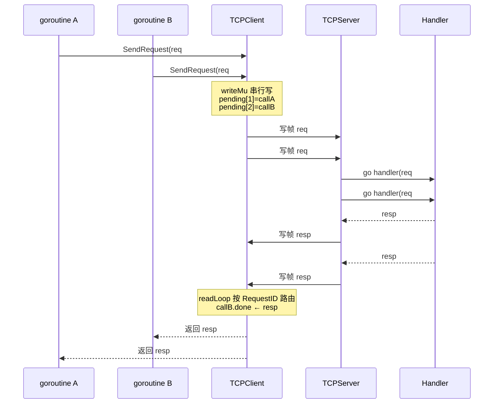

# 模块：Transport（传输层）

## 职责

- 定义 `ClientTransport` 和 `ServerTransport` 两个抽象接口
- 提供 TCP 实现：`TCPClient`（NoDelay + KeepAlive）和 `TCPServer`（双信号量并发控制）
- 实现 `ProtocolCodec`：两阶段读取（先 20B Header，再 BodyLength 字节 Body）
- 通过 `DefaultConnectionFactory` 和 `RetryConnectionFactory` 支持连接工厂模式

**源码位置**：`pkg/transport/tcp/`（client.go 261 行、server.go 330 行、codec.go 204 行）

## 关键文件

| 文件 | 行数 | 职责 |
|------|------|------|
| `pkg/transport/transport.go` | — | 接口定义（ClientTransport / ServerTransport / Handler） |
| `pkg/transport/options.go` | — | ClientOptions / ServerOptions 定义 |
| `pkg/transport/tcp/client.go` | 261 | TCPClient 实现 |
| `pkg/transport/tcp/server.go` | 330 | TCPServer 实现，双信号量 |
| `pkg/transport/tcp/codec.go` | 204 | ProtocolCodec：两阶段帧读写 |

---

## 接口定义

### ClientTransport

```go
// pkg/transport/transport.go
type ClientTransport interface {
    Dial(ctx context.Context, addr string) error
    // 多路复用核心：同一连接上可并发调用，按 RequestID 路由响应
    SendRequest(ctx context.Context, req *protocol.Request) (*protocol.Response, error)
    Close() error
    IsConnected() bool
    LocalAddr() net.Addr
    RemoteAddr() net.Addr
}
```

旧的 `Send([]byte) []byte` 接口已移除。`SendRequest` 是唯一的发送入口，内部通过 pending map + readLoop 实现多路复用，不再需要每个请求独占连接的写锁。

### ServerTransport

```go
type ServerTransport interface {
    Listen(ctx context.Context, addr string) error
    Serve(ctx context.Context, handler Handler) error
    Close() error
    Addr() net.Addr
}
```

### Handler（请求处理回调）

```go
// Server 将自身的 HandleRequest 方法作为 Handler 传给 ServerTransport
type Handler func(ctx context.Context, req *protocol.Request) (*protocol.Response, error)
```

### Connection

```go
type Connection interface {
    io.ReadWriter
    io.Closer
    LocalAddr() net.Addr
    RemoteAddr() net.Addr
    SetDeadline(t time.Time) error
    SetReadDeadline(t time.Time) error
    SetWriteDeadline(t time.Time) error
}
```

---

## TCPClient 实现（多路复用）

### 核心结构

```go
// pkg/transport/tcp/client.go
type Client struct {
    conn      net.Conn
    Codec     *ProtocolCodec
    mu        sync.RWMutex   // 保护 connected / conn 字段

    writeMu   sync.Mutex              // 串行化并发写，防止帧交错
    pendingMu sync.Mutex              // 保护 pending map
    pending   map[uint64]*pendingCall // requestID → 等待响应的调用
    closeCh   chan struct{}            // 连接关闭广播
    closeOnce sync.Once
}

type pendingCall struct {
    done     chan struct{}
    respBody []byte // 解压后的响应 body bytes，由调用方解码
    err      error
}
```

### 多路复用工作流

1. `Dial` 建立连接，初始化 pending map，启动 `readLoop(conn)` goroutine
2. `SendRequest` 在 pending map 中注册 call，通过 `writeMu` 串行写请求，然后阻塞等待 channel
3. `readLoop` 持续读响应帧，按 `header.RequestID` 找到对应 call，写入 body 并关闭 channel
4. `SendRequest` 从 channel 唤醒，解码响应返回给调用方
5. ctx 超时时，从 pending 删除 call；迟到的响应找不到 call 时静默丢弃
6. `Close()` 关闭底层 conn，同时通过 `closeWithError` 唤醒所有 pending caller

---

## TCPServer 实现（多路复用）

### 并发模型

每个连接上读写分离：读循环快速派发，writer goroutine 通过 channel 串行写，`handlersWg` 确保关闭时无 panic。

```
Accept() ← 主 goroutine
    │
    └── 每个连接（受 connSemaphore 限制）
            │
            ├── read loop（快速读，立即派发）
            │       │
            │       └── go handler goroutine（受 reqSemaphore 限制）
            │               └── handler(ctx, req) → writeCh <- resp
            │
            └── writer goroutine（从 writeCh 串行写回 conn）
```

关键实现要点：

- `handlersWg.Wait()` 后才 `close(writeCh)`，避免 `send on closed channel`
- `writeCh` 带 64 缓冲，让 handler goroutine 无需等待 writer 就能继续
- 请求级信号量 `reqSemaphore` 在 read loop 内做非阻塞检查，满载时直接回 Unavailable 错误

### 服务端统计

```go
type ServerStats struct {
    TotalConnections  int64 // 总建立连接数（原子）
    ActiveConnections int64 // 当前活跃连接数（原子）
    Address           string
}
```

---

## ProtocolCodec（两阶段帧读写）

### 关键方法签名

```go
type ProtocolCodec struct{}

// 两阶段读取：先读 Header，再按 BodyLength 读 Body
func (c *ProtocolCodec) ReadRequest(r io.Reader, codec codec.Codec) (*protocol.Request, error)
func (c *ProtocolCodec) ReadResponse(r io.Reader, codec codec.Codec) (*protocol.Response, error)

// 编码并写入（内部使用 writeFull 保证字节完整写入，防止大消息被截断）
func (c *ProtocolCodec) WriteRequest(w io.Writer, req *protocol.Request, codec codec.Codec) error
func (c *ProtocolCodec) WriteResponse(w io.Writer, resp *protocol.Response, codec codec.Codec) error
```

### 两阶段读取实现

```go
func (c *ProtocolCodec) ReadRequest(r io.Reader, codec codec.Codec) (*protocol.Request, error) {
    // 阶段 1：精确读取固定 20 字节 Header
    headerBuf := make([]byte, protocol.HeaderSize)
    if _, err := io.ReadFull(r, headerBuf); err != nil {
        return nil, err
    }
    header, err := decodeHeader(headerBuf)
    if err != nil {
        return nil, err
    }

    // 防止超大请求体导致 OOM
    if header.BodyLength > maxBodySize {
        return nil, fmt.Errorf("request body too large: %d > %d",
            header.BodyLength, maxBodySize)
    }

    // 阶段 2：按 BodyLength 读取变长 Body
    body := make([]byte, header.BodyLength)
    if _, err := io.ReadFull(r, body); err != nil {
        return nil, err
    }

    // 如有压缩，先解压
    if header.Compress != protocol.CompressTypeNone {
        compressor := codec.GetCompressor(header.Compress)
        body, err = compressor.Decompress(body)
        if err != nil {
            return nil, err
        }
    }

    // 用对应 Codec 解码 Body
    req := &protocol.Request{}
    if err := codec.Decode(body, req); err != nil {
        return nil, err
    }
    return req, nil
}
```

---

## Options 配置

### ClientOptions

```go
// pkg/transport/options.go
type ClientOptions struct {
    DialTimeout   time.Duration // 连接建立超时，默认 5s
    KeepAlive     time.Duration // TCP KeepAlive 间隔，默认 30s
    ReadTimeout   time.Duration // 读超时，默认 30s
    WriteTimeout  time.Duration // 写超时，默认 30s
    BufferSize    int           // 读写缓冲大小，默认 4096 字节
    MaxRetries    int           // 连接失败最大重试次数，默认 3
    RetryInterval time.Duration // 重试间隔，默认 1s
}
```

### ServerOptions

```go
type ServerOptions struct {
    ReadTimeout           time.Duration // 读超时，默认 30s
    WriteTimeout          time.Duration // 写超时，默认 30s
    MaxConcurrentRequests int           // 最大并发请求数，默认 10000
    WorkerPoolSize        int           // goroutine 池大小，默认 100
    BufferSize            int           // 读写缓冲大小，默认 4096 字节
    MaxRequestBodySize    int64         // 最大请求体大小，默认 10MB
    MaxConnections        int           // 最大连接数，默认 10000
}
```

## 多路复用数据流



## 架构中的位置

```
pkg/server ──── 实现 Handler ────► pkg/transport（接口）
                                        │
                                        ▼
                                  pkg/transport/tcp
                                  （唯一实现）
                                        ▲
                               pkg/pool（连接池封装 TCPClient）
```

## 边界情况

- **连接断开检测**：`SetReadDeadline` 超时或 `io.ReadFull` 返回 `io.EOF`
- **Magic 校验失败**：立即关闭连接，防止帧错位持续污染
- **BodyLength 超大**：有 `maxBodySize`（10MB）保护，防止 OOM
- **半关闭连接**：KeepAlive 帮助检测，FIN 延迟到达时短暂误判
- **写入不完整**：`WriteRequest`/`WriteResponse` 使用 `writeFull` 循环写入，确保大消息在内核缓冲区满时不被截断（`net.Conn.Write` 不保证一次写完全部字节）

## 测试

| 测试文件 | 内容 |
|---------|------|
| `pkg/transport/tcp/client_test.go` | 连接、SendRequest、多路复用并发、乱序路由 |
| `pkg/transport/tcp/server_test.go` | Echo、并发、超时 |
| `pkg/transport/tcp/codec_test.go` | 两阶段帧读写正确性 |

## Source References

- `pkg/transport/transport.go`
- `pkg/transport/options.go`
- `pkg/transport/tcp/client.go`（261 行）
- `pkg/transport/tcp/server.go`（330 行）
- `pkg/transport/tcp/codec.go`（204 行）
- `wiki/transport/interfaces.md`
- `wiki/transport/tcp.md`
- `wiki/transport/connection-pool.md`
